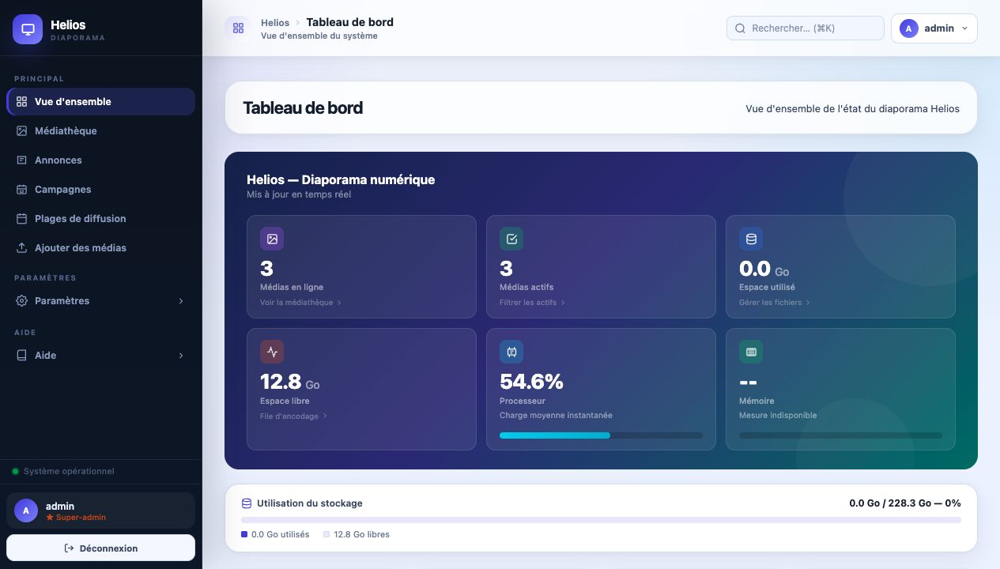
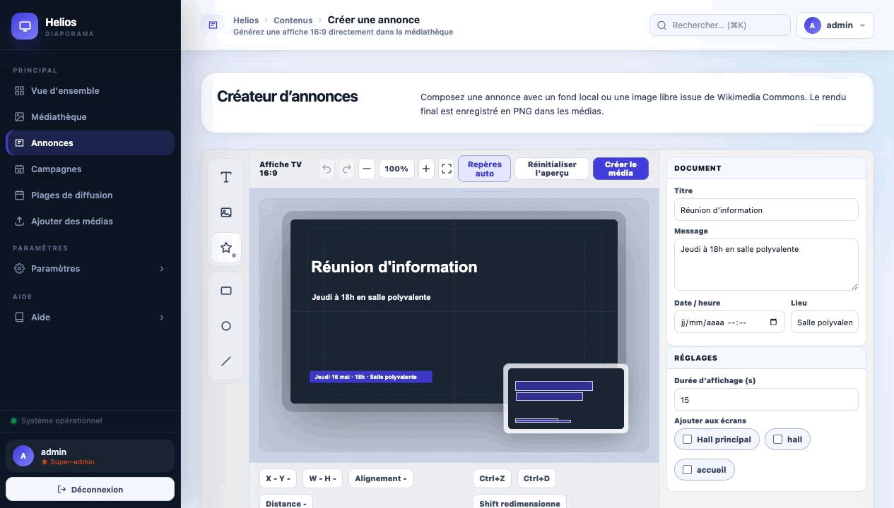
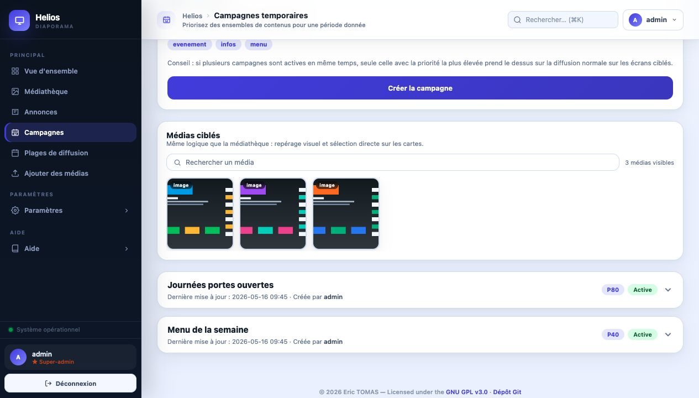
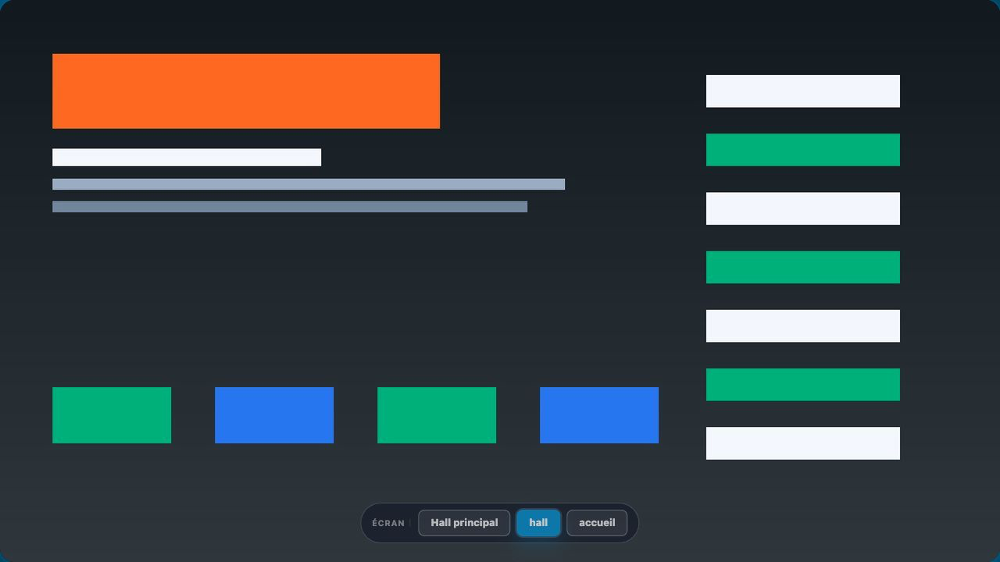
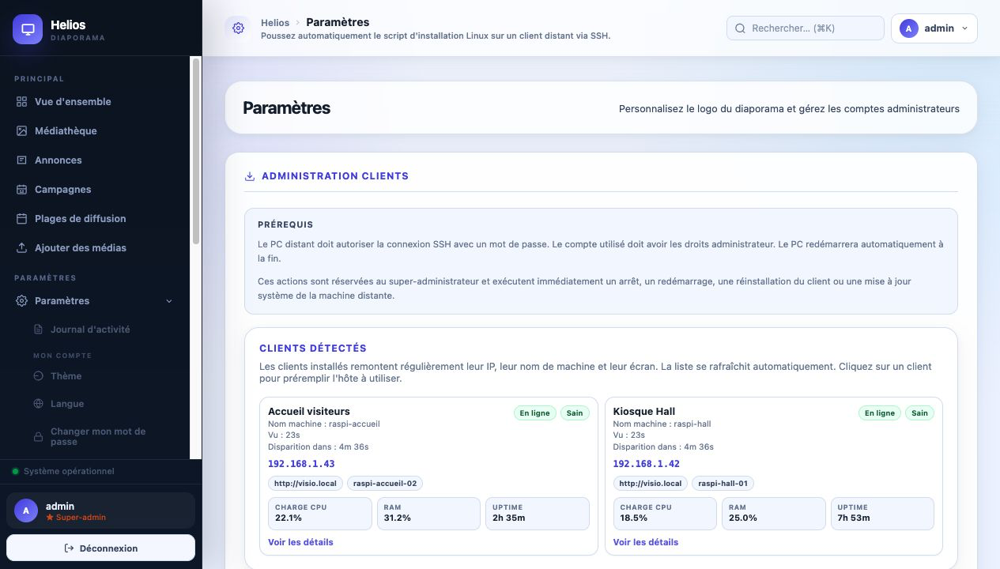
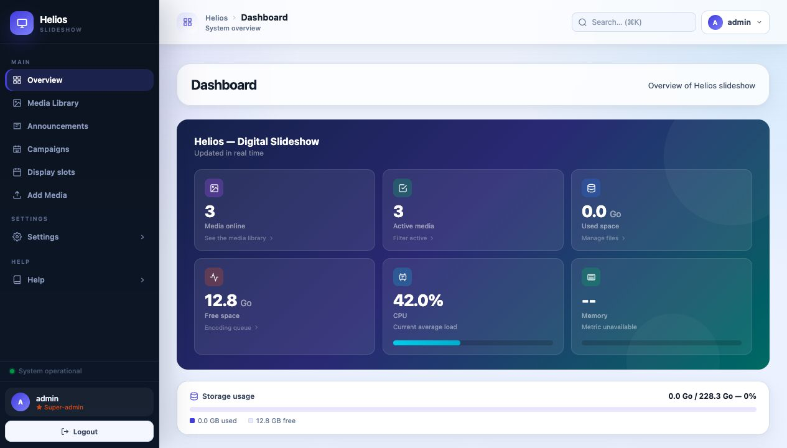
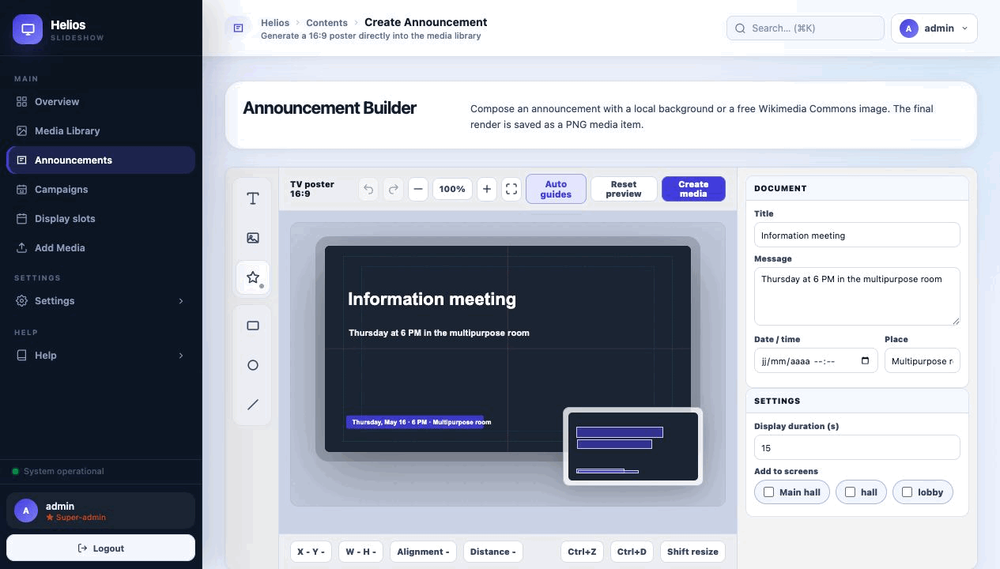
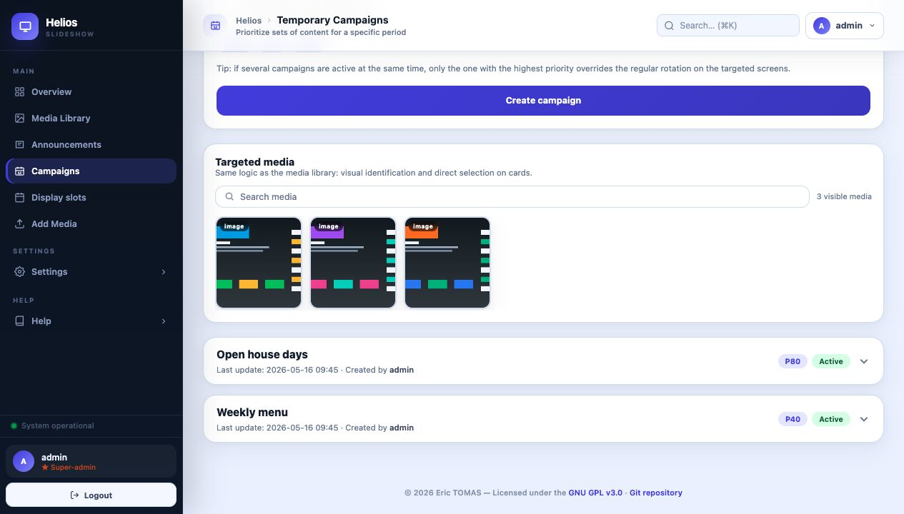
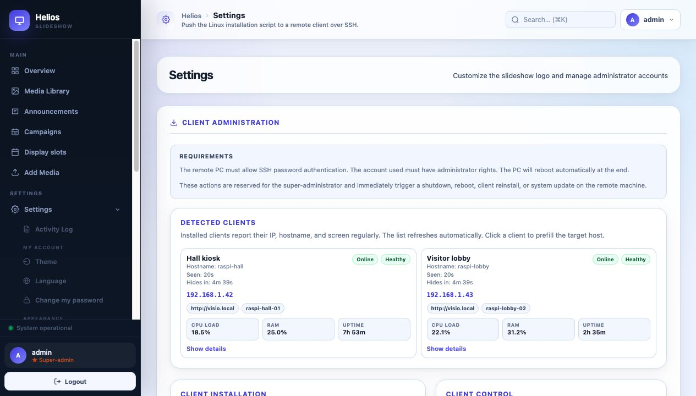

<!-- Licensed under the GNU General Public License v3.0 (GPL-3.0). Copyright (c) 2026 Eric TOMAS (Woofix). See the LICENSE file for details. -->

# Visio-Display — Plateforme self-hosted d'affichage dynamique · Self-hosted digital signage platform

[🇫🇷 Français](#français) · [🇺🇸 English](#english)

---

## Français

Visio-Display est une plateforme moderne de **digital signage self-hosted**, pensée pour piloter plusieurs écrans depuis une administration web centralisée. Elle combine gestion de médias, campagnes temporaires, groupes, clients kiosque distants, monitoring, RBAC, sauvegardes, mise à jour serveur et éditeur graphique 16:9 dans une stack Docker-native simple à exploiter.

Le projet cible les environnements homelab, devops, associations, établissements, commerces et organisations qui veulent garder le contrôle local de leurs données tout en déployant une solution complète avec Flask, PostgreSQL, Redis, RQ et Docker Compose.

### Pourquoi Visio-Display ?

Les solutions d'affichage dynamique cloud sont souvent pratiques au démarrage, mais elles imposent rapidement des abonnements, des dépendances externes, des limites de confidentialité ou un verrouillage fournisseur. À l'inverse, beaucoup de solutions auto-hébergées restent lourdes, anciennes, difficiles à maintenir ou trop fermées pour un usage quotidien.

Visio-Display existe pour offrir une alternative claire : une plateforme self-hosted complète, déployable avec Docker Compose, administrable depuis un navigateur, capable de gérer plusieurs écrans et clients kiosque sans externaliser les données. L'objectif est de rester simple à installer, lisible pour un administrateur système, et assez moderne pour s'intégrer naturellement dans un homelab, un serveur associatif, une VM interne ou une petite infrastructure devops.

### Points forts

- Gestion multi-écrans avec écrans nommés, listes indépendantes et diffusion d'une liste vers d'autres écrans
- Campagnes temporaires avec dates, priorités, groupes, médias ciblés et écrans concernés
- Groupes de médias, pools par passage, activation/désactivation par groupe et restrictions par écran
- Éditeur graphique intégré 16:9 avec calques, grille, snap, icônes Lucide/Tabler et export PNG 1920×1080
- Installation distante de clients kiosque via SSH, autologin, URL d'affichage sécurisée et nom d'écran
- Heartbeat clients, watchdog kiosque, état des clients et actions d'alimentation depuis l'administration
- Mise à jour serveur depuis l'admin avec contrôles Git/Docker, verrou système et redémarrage assisté
- Sauvegarde/restauration Docker et sauvegardes web avec progression et conservation automatique
- RBAC avec rôles personnalisés, permissions granulaires et restrictions d'accès par écran
- Recherche globale, journal d'activité, API JSON et interface d'administration responsive

### Architecture rapide

Visio-Display s'exécute comme une stack self-hosted Docker Compose :

- **Flask / Gunicorn** sert l'administration, l'affichage public, l'API et les exports d'annonces
- **PostgreSQL** stocke la configuration applicative, les utilisateurs, rôles, jobs, clients et journaux
- **Redis + RQ worker** exécutent les traitements asynchrones, notamment l'encodage et la compression vidéo
- **Volumes hôte** conservent les médias publics (`MEDIA_DIR`) et les données privées (`PRIVATE_DIR`)
- **Clients kiosque** ouvrent l'URL d'affichage sécurisée, remontent leur heartbeat et peuvent être gérés depuis l'admin

### Captures











### Fonctionnalités

**Affichage public**
- Affichage plein écran sécurisé avec transitions en fondu enchaîné
- Images (JPG, PNG), vidéos (MP4, MOV, AVI, MKV, WebM — ré-encodées automatiquement en H.264) et PDF (convertis en images)
- Durée d'affichage configurable par média
- Liste rafraîchie à chaque rotation — les modifications s'appliquent immédiatement

**Carte éphéméride**
- Générée automatiquement chaque jour (rafraîchissement toutes les 2 heures)
- Saint du jour via [nominis.cef.fr](https://nominis.cef.fr)
- Météo actuelle (température, vent, précipitations) via [Open-Meteo](https://open-meteo.com)
- Heures de lever et coucher du soleil via [sunrise-sunset.org](https://sunrise-sunset.org)
- Comptes à rebours vers des événements configurables (bac, vacances, JPO…)

**Programmation temporelle**
- Plages horaires par média — ex. menu cantine visible seulement entre 11h et 13h
- Dates d'activation/désactivation — un média actif du 2 au 15 juin uniquement
- Les deux contraintes sont combinables et indépendantes par fichier

**Gestion des écrans multiples**
- Création d'écrans nommés (ex. `hall`, `refectoire`, `salle-b12`)
- Chaque écran dispose de sa propre liste de médias, son propre ordre, ses propres désactivations, durées et programmations
- Les médias de la médiathèque principale sont assignés à un ou plusieurs écrans
- L'affichage public s'adapte automatiquement selon le paramètre `?screen=<nom>` dans l'URL
- Sélecteur d'écran intégré à la page d'affichage public — barre flottante en bas, permet de basculer d'écran sans retaper l'URL
- Tableau de bord : la carte **Prévisualiser** affiche un bouton par écran pour ouvrir directement l'affichage correspondant dans un nouvel onglet
- Médiathèque : bouton **Prévisualiser** à droite de la barre d'écrans pour ouvrir une fenêtre d'aperçu de l'écran actif
- Diffusion d'une liste d'écran vers d'autres écrans : ordre, activations, groupes désactivés, durées et programmations sont copiés vers les cibles sélectionnées

**Groupes de médias**
- Taguer les médias avec un ou plusieurs groupes libres (ex. `menu`, `infos`, `urgences`)
- Activer ou désactiver tous les médias d'un groupe d'un seul clic depuis la médiathèque
- Les groupes sont indépendants par écran (désactivation individuelle ou par groupe)
- Liaison écrans : chaque groupe peut être restreint à un ou plusieurs écrans spécifiques — sans liaison il est global (visible sur tous les écrans)
- Tirage par groupe : définir combien de médias d'un groupe sont affichés par passage (`0` = tous)

**Campagnes temporaires**
- Créer des campagnes événementielles ciblant des groupes et/ou des médias précis
- Définir une période de diffusion, une priorité et les écrans concernés
- La campagne active la plus prioritaire remplace temporairement la rotation normale sur ses écrans cibles
- Duplication, activation/désactivation rapide, archivage et restauration depuis l'interface
- Affichage mobile lisible : écrans ciblés en lignes pleine largeur et vignettes de médias agrandies

**Alerte prioritaire**
- Diffusion instantanée d'un message en bannière sur l'écran d'affichage (super-admin uniquement)
- Publication automatique à chaque frappe, sans rechargement ni interruption de l'affichage
- Effacement en un clic — visible sur tous les écrans simultanément

**Éditeur d'annonces intégré**
- Création d'annonces directement dans Visio-Display depuis un éditeur graphique 16:9
- Canvas central avec grille discrète, guides de sécurité, snap visuel et zoom
- Barre d'outils gauche pour ajouter texte, formes, lignes, images et icônes
- Panneau contextuel droit avec réglages de document, style, position et calques selon la sélection
- Système de calques compact : renommage, ordre, visibilité, verrouillage et déplacement
- Gestion avancée des images : plusieurs images libres, remplissage d'un rectangle ou d'un cercle avec masque conservé, zoom/positionnement dans la forme et choix cover/contain/stretch pour le fond
- Export PNG 1920×1080 vers la médiathèque, avec durée d'affichage et écrans ciblés
- Bibliothèques d'icônes locales Lucide et Tabler chargées dynamiquement

**Interface d'administration**
- Importation par glisser-déposer avec barre de progression animée (shimmer) et prévisualisation
- Animation d'upload professionnelle : spinner rotatif, pourcentage en temps réel et overlay animé pendant l'envoi
- Validation des formats à la sélection : bannière d'erreur listant les fichiers refusés (extension non supportée) avec rappel des formats acceptés
- Activation / désactivation des médias sans suppression
- Réorganisation par glisser-déposer (vues grille et liste) — désactivée automatiquement lors d'une recherche ou d'un filtre actif
- Vues mobile différenciées : grandes vignettes en grille, liste compacte avec miniature et actions
- Durée d'affichage personnalisée par média
- Programmation horaire et/ou par dates par média
- Assignation des médias aux écrans nommés par bouton — l'item devient immédiatement actif sur l'écran cible
- Encodage vidéo asynchrone à l'import — barre de progression en temps réel
- File de compression vidéo nocturne (fenêtre 20h–6h) — progression visible, forçable par le super-admin
- Statistiques d'utilisation du disque
- Visionneuse plein écran au clic
- Nom de l'application personnalisable
- Choix de la langue de l'interface (français / anglais)
- Choix du thème de l'interface : Violet, Sombre, Bleu — le thème mobile suit automatiquement le choix utilisateur
- Navigation responsive : la barre latérale reste visible en desktop ; le bouton de menu mobile n'apparaît qu'en largeur cellulaire
- Recherche globale instantanée (`Cmd+K` / `Ctrl+K`) : médias, campagnes, utilisateurs, configuration, journal d'activité — visible aussi en topbar mobile

**Journal d'activité**
- Enregistre les actions d'exploitation et d'administration : uploads, suppressions, connexions/déconnexions, activations/désactivations, compressions vidéo, changements de configuration et actions sur les campagnes
- Chaque entrée indique l'utilisateur responsable, le fichier concerné et les détails (état, taille avant/après…)
- Filtres par type d'action, par utilisateur et recherche libre (`Upload`, `Suppression`, `Connexion`, `Déconnexion`, `Activation`, `Compression`, `Configuration`, `Campagne`)
- Les compressions automatiques nocturnes sont tracées sous l'utilisateur `system`
- Purge automatique des anciennes entrées + plafond de lignes pour éviter l'explosion de l'espace disque
- Sur mobile, le journal est présenté en cartes empilées pour éviter les débordements horizontaux

**Wiki intégré**
- Page d'aide accessible depuis l'interface d'administration (`/admin/wiki`)
- Documentation interactive couvrant toutes les fonctionnalités, disponible sans quitter l'application
- Version Markdown fournie dans `USER_GUIDE.md` pour la documentation du projet

**Gestion des rôles (RBAC)**
- Créer des rôles personnalisés (identifiant, nom affiché, description, permissions) depuis `/admin/roles`
- Trois rôles prédéfinis au démarrage : *Administrateur* (toutes les permissions), *Éditeur* (upload/suppression/réorganisation/activation/durée), *Lecteur* (aucune permission)
- Attribuer un ou plusieurs rôles à chaque utilisateur — les permissions effectives sont l'union des permissions de tous les rôles attribués
- Les rôles système ne peuvent pas être supprimés

**Gestion des fonctionnalités**
- Activer ou désactiver 12 modules depuis `Paramètres → Fonctionnalités` (super-admin uniquement) : importation de médias, annonces, vidéos, suppression, compression, éphéméride, campagnes, plages de diffusion, groupes, multi-écrans, alerte prioritaire, journal d'activité
- Un module désactivé masque entièrement les menus, boutons et endpoints concernés pour tous les utilisateurs

**À propos**
- Page `/admin/about` accessible à tous les utilisateurs connectés : version de l'application, commit git, stack technique et lien vers la licence

**Mise à jour serveur**
- Page `/admin/version` réservée au super-admin : vérification du dépôt Git installé et application d'une mise à jour disponible
- Overlay bloquant pendant les opérations système : l'administration est verrouillée jusqu'à la fin de la mise à jour

**Sécurité & accès**
- Contrôle d'accès à deux niveaux : super-admin et utilisateurs limités
- Permissions granulaires configurables par compte, regroupables en rôles réutilisables
- Restrictions d'accès par écran — un utilisateur peut gérer un ou plusieurs écrans spécifiques

### Prérequis

- Docker
- Docker Compose

### Quick Start

```bash
git clone https://github.com/woofix/visio_display.git Visio-Display
cd Visio-Display
./scripts/security_bootstrap.sh install .
docker compose up -d --build
```

L'application est disponible sur `http://<hôte>:8081`. Ouvrir l'administration sur `http://<hôte>:8081/admin`, puis l'affichage public avec `?screen_token=<DISPLAY_API_TOKEN>`.

### Installation

**Cette section concerne uniquement l'installation du serveur Visio-Display.**

```bash
bash <(curl -fsSL https://raw.githubusercontent.com/woofix/visio_display/main/server-install.sh)
```

L'application est disponible sur `http://<hôte>:8081`.

**SECRET_KEY du serveur (obligatoire) :**

Cette clé sert à signer les sessions Flask du serveur. Elle reste nécessaire même si les clients sont ensuite installés à distance via SSH.

**Générer une valeur aléatoire sécurisée :**

```bash
python3 -c "import secrets; print(secrets.token_hex(32))"
```

**Pour installer un client d'affichage distant et le surveiller depuis l'administration :**
- installer d'abord le serveur avec les étapes ci-dessus ;
- puis aller plus bas dans la section **Utilisation**, sous **Installation automatisée d'un client** ;
- cette partie décrit l'installation à distance via SSH, l'autologin, le mode kiosque et le heartbeat client visible dans l'admin.

### Configuration

**Variables d'environnement (`.env`)**

| Variable         | Description                                                        |
|------------------|--------------------------------------------------------------------|
| `ADMIN_USER`     | Nom du compte super-admin (créé au premier démarrage uniquement)   |
| `ADMIN_PASSWORD` | Mot de passe du super-admin (10 caractères minimum)                |
| `SECRET_KEY`     | Clé de signature des sessions Flask (obligatoire)                  |
| `POSTGRES_PASSWORD` | Mot de passe du rôle PostgreSQL `visio` utilisé par la stack Docker |
| `MEDIA_DIR` | Dossier hôte obligatoire contenant les médias publics et leurs rendus |
| `PRIVATE_DIR` | Dossier hôte obligatoire contenant les données privées d’exécution |
| `VISIO_HOST_ROOT` | Racine hôte du dépôt montée dans Docker pour les mises à jour/redémarrages depuis l'administration (défaut : `.`) |
| `VISIO_UPDATE_BRANCH` | Branche cible utilisée par la page de mise à jour serveur (défaut : `main`) |
| `VISIO_UPDATE_REMOTE` | Remote Git utilisée par la page de mise à jour serveur (défaut : `origin`) |
| `CLIENT_HEARTBEAT_TOKEN` | Jeton partagé exigé par `/api/client-heartbeat` |
| `DISPLAY_API_TOKEN` | Jeton écran obligatoire exigé par `/` et les endpoints publics d'affichage |
| `UPDATER_API_TOKEN` | Jeton interne obligatoire entre `app` et le service Docker privilégié `updater` |
| `SESSION_COOKIE_SECURE` | Force le cookie de session en mode `Secure` (recommandé derrière HTTPS) |
| `SESSION_COOKIE_NAME` | Nom du cookie de session Flask (défaut : `visio_session`) |
| `SESSION_LIFETIME_MINUTES` | Durée de vie maximale d’une session connectée (défaut : `480`) |
| `TRUSTED_HOSTS` | Liste d’hôtes autorisés séparés par des virgules pour filtrer l’en-tête `Host` |
| `TRUST_PROXY_COUNT` | Nombre de proxies inverse de confiance pour interpréter `X-Forwarded-*` |

`scripts/security_bootstrap.sh install .` crée les secrets absents, refuse les valeurs faibles pendant une installation, ajoute `MEDIA_DIR`, `PRIVATE_DIR` et `VISIO_HOST_ROOT` s’ils manquent, applique `chmod 600` sur `.env`, crée `MEDIA_DIR` et `PRIVATE_DIR/backups`, puis applique `chmod 700` sur `PRIVATE_DIR` et ses sauvegardes. En mise à jour, `scripts/security_bootstrap.sh update .` ajoute uniquement les clés manquantes et signale les valeurs faibles sans remplacer `SECRET_KEY` ni `POSTGRES_PASSWORD`. La stack Docker exige `MEDIA_DIR`, `PRIVATE_DIR`, `DISPLAY_API_TOKEN` et `UPDATER_API_TOKEN` dans `.env` et refuse de démarrer s’ils sont absents.

Dans Docker, `MEDIA_DIR` et `PRIVATE_DIR` de `.env` désignent les dossiers hôte persistants; ils sont montés dans le conteneur sur `/app/static/data` et `/app/data`, qui sont seulement des chemins internes de conteneur.

> Ces variables d'initialisation applicative ne sont lues qu'une seule fois, lors du premier démarrage (base de données absente).
>
> `POSTGRES_PASSWORD` ne recrée pas automatiquement l'utilisateur PostgreSQL si le volume `postgres_data` existe déjà. Si vous voyez `password authentication failed for user "visio"`, le mot de passe stocké dans le volume Postgres ne correspond plus à celui de votre `.env`.

**Dépannage PostgreSQL**

- Vérifier d'abord que `POSTGRES_PASSWORD` a la même valeur dans `.env` que celle utilisée au tout premier démarrage de `postgres`.
- Si les données PostgreSQL peuvent être supprimées en toute sécurité, recréez le volume puis relancez la stack : `docker compose down -v` puis `docker compose up -d --build`.
- Si vous devez conserver les données, changez le mot de passe du rôle `visio` dans le conteneur Postgres pour le réaligner avec `.env`, ou remettez temporairement l'ancienne valeur dans `.env`.

**Durcissement HTTP / session**

- Cookie de session signé avec `SECRET_KEY`, marqué `HttpOnly` et `SameSite=Lax`
- Cookie `Secure` activable via `SESSION_COOKIE_SECURE=1` pour un déploiement derrière HTTPS
- Durée de session bornée via `SESSION_LIFETIME_MINUTES` sans rafraîchissement infini à chaque requête
- Protection CSRF sur toutes les requêtes d'écriture (`POST`, JSON et formulaires)
- Déconnexion réalisée en `POST` protégé par CSRF, pas en simple lien `GET`
- Filtrage d'hôtes via `TRUSTED_HOSTS` et prise en charge d'un reverse proxy via `TRUST_PROXY_COUNT`
- `CLIENT_HEARTBEAT_TOKEN` protège l'endpoint de heartbeat client et doit être partagé avec les clients kiosque installés
- `DISPLAY_API_TOKEN` est obligatoire. Il protège la page `/` et les endpoints publics d'affichage ; envoyer `X-Screen-Token: <jeton>` ou `?screen_token=<jeton>`. Les anciens clients sans jeton reçoivent `403` et n'affichent rien.
- Les sauvegardes dans `PRIVATE_DIR/backups` peuvent contenir des données sensibles et sont verrouillées en `chmod 700`
- Les archives de sauvegarde peuvent inclure une copie de `.env` (`env.backup`) et doivent être manipulées comme des secrets.
- En-têtes de sécurité appliqués: CSP, HSTS en HTTPS, `X-Frame-Options`, `X-Content-Type-Options`, `Referrer-Policy`, `Permissions-Policy`, `Cross-Origin-Opener-Policy` et `Cross-Origin-Resource-Policy`

**Localisation météo** — configurable depuis l'interface (`/admin/settings?tab=meteo`, super-admin) :

| Champ        | Description                                            | Valeur par défaut |
|--------------|--------------------------------------------------------|-------------------|
| Ville        | Nom affiché sur la carte éphéméride                    | Perpignan         |
| Latitude     | Coordonnée GPS pour météo et lever/coucher du soleil   | 42.6977           |
| Longitude    | Coordonnée GPS pour météo et lever/coucher du soleil   | 2.8956            |
| Fuseau horaire | Fuseau IANA (ex. `Europe/Paris`)                     | Europe/Paris      |
| Zone scolaire | Zone de l'Éducation nationale (`A`, `B`, `C`) — détection automatique si non renseignée | auto |

La modification régénère automatiquement la carte éphéméride.

**Résolution des images** — modifier dans `web/constants.py` :

| Variable           | Description                     | Valeur par défaut |
|--------------------|---------------------------------|-------------------|
| `MAX_WIDTH/HEIGHT` | Dimensions maximales des images | 1920 × 1080       |

### Utilisation

**Affichage public :** ouvrir `http://<hôte>:8081?screen_token=<DISPLAY_API_TOKEN>` dans un navigateur plein écran.

**Affichage public sur un écran nommé :** `http://<hôte>:8081?screen=<nom>&screen_token=<DISPLAY_API_TOKEN>`

**Mode kiosque sur Raspberry Pi :**

```bash
chromium-browser --kiosk --noerrdialogs --disable-infobars 'http://localhost:8081?screen_token=<DISPLAY_API_TOKEN>'
```

Avec le client installé via `scripts/install.sh`, la session kiosque désactive automatiquement la mise en veille de l'écran (DPMS/X11) et inhibe la veille machine tant que le navigateur d'affichage est lancé.
Le client construit automatiquement l'URL d'affichage à partir de l'URL du serveur et du nom d'écran configurés lors de l'installation.

**Installation automatisée d'un client distant :**

Depuis l'onglet **Paramètres > Installation client**, renseigner :
- l'hôte ou l'IP du client ;
- le port SSH ;
- l'utilisateur SSH ;
- le **mot de passe SSH** (requis — nécessite `sshpass` installé sur le serveur) ;
- le **mot de passe admin / sudo** (optionnel — réutilise le mot de passe SSH si identique) ;
- l'utilisateur local à configurer pour l'autologin ;
- l'URL d'écran générée par l'interface, qui inclut `screen_token` ;
- le nom d'écran (ex. `reception` ou `cuisine`) ;
- le nom de la machine cliente.

Le script distant configure alors automatiquement :
- l'autologin et le mode kiosque ;
- le nom de machine Linux ;
- l'URL d'affichage finale, avec `screen_token` et `screen=<nom>` si un écran est défini ;
- le heartbeat client vers `/api/client-heartbeat` avec `CLIENT_HEARTBEAT_TOKEN`.

**Surveillance des clients :**

Les clients détectés dans l'administration sont rafraîchis automatiquement et les nouvelles installations envoient un heartbeat toutes les 30 secondes environ.
Le super-admin peut aussi configurer le watchdog kiosque, arrêter/redémarrer un client détecté, réinstaller le client ou lancer une mise à jour Debian distante depuis **Paramètres > Installation client**.

**Mise à jour serveur depuis l'administration :**

Depuis **Paramètres > Version**, le super-admin peut vérifier la version distante, appliquer une mise à jour disponible depuis le dépôt Git installé, puis redémarrer la stack Docker. La page admin ne monte plus `/var/run/docker.sock` dans le service `app` : elle appelle le service interne `updater` via le réseau Docker avec `UPDATER_API_TOKEN`. Seul `updater` possède Docker CLI/Compose et le socket Docker; il n'expose aucun port public et n'accepte que les opérations allowlistées de statut, mise à jour, redémarrage et test.

La mise à jour refuse de continuer si le dépôt n'est pas propre, si le remote/branche cible est introuvable ou si Docker Compose n'est pas accessible côté updater. Pendant l'application ou le redémarrage, un verrou système persistant affiche un overlay bloquant sur l'administration et empêche les autres actions jusqu'à la fin de l'opération. En cas d'échec, consultez les logs NDJSON visibles sur la page, puis vérifiez `docker compose logs updater app` et relancez **Vérifier**.

**Interface d'administration :** ouvrir `http://<hôte>:8081/admin` et se connecter.

**Créer une annonce :** ouvrir **Annonces** dans le menu d'administration. L'éditeur affiche un canvas 16:9 au centre, une barre d'outils à gauche et un panneau contextuel à droite.

- Cliquez sur **Texte**, **Rectangle**, **Cercle**, **Ligne** ou **Icône** pour créer un nouveau calque.
- Cliquez sur un élément du canvas pour afficher ses propriétés : style, position/taille et calques.
- Cliquez dans le vide du canvas ou sur **Aperçu** pour revenir aux réglages du document : titre, message, fond, durée et écrans.
- L'outil **Image** ouvre le panneau **Fond / Images** : choisissez un fond depuis upload, médiathèque ou banque externe, ou ajoutez plusieurs images comme calques indépendants.
- Sélectionnez un rectangle ou un cercle puis utilisez **Remplir la forme** pour y placer une image ; les réglages de zoom et de décalage déplacent l'image dans son masque sans la faire dépasser.
- Le bouton **Snap** active ou désactive l'alignement automatique sur la grille, les guides centraux et les autres objets.
- Le bouton **Exporter** crée un PNG 1920×1080 et l'ajoute à la médiathèque avec la durée et les écrans choisis.

**Réinitialiser un mot de passe super-admin (hors interface) :**

Avec Docker Compose, lancez la commande depuis la racine du projet :

```bash
docker compose exec app python3 /app/tools/reset_superadmin_password.py --list
docker compose exec app python3 /app/tools/reset_superadmin_password.py --user <nom-super-admin>
```

Le script détecte automatiquement `DATABASE_URL` dans le conteneur `app`. Le projet fonctionne désormais uniquement avec PostgreSQL.

```bash
printf '%s\n' '<nouveau-mot-de-passe>' | docker compose exec -T app python3 /app/tools/reset_superadmin_password.py --user <nom-super-admin> --password-stdin
```

Sans Docker, exportez `DATABASE_URL` ou passez `--database-url` :

```bash
cd web
python3 tools/reset_superadmin_password.py --list
python3 tools/reset_superadmin_password.py --user <nom-super-admin>
```

Le script demande le nouveau mot de passe de façon masquée, met à jour uniquement le hash PostgreSQL, force le changement du mot de passe à la prochaine connexion et ajoute une trace dans le journal d'activité. Si un seul super-admin existe, l'option `--user` est facultative.
Le mot de passe du super-admin ne peut pas être réinitialisé depuis l'interface d'administration.

**Commande en une seule ligne :**

```bash
cd web && printf '%s\n' '<nouveau-mot-de-passe>' | python3 tools/reset_superadmin_password.py --user <nom-super-admin> --password-stdin
```

Si un seul compte super-admin existe, vous pouvez omettre `--user <nom-super-admin>`.

### Sauvegarde et restauration Docker

Pour pouvoir repartir sur un nouveau serveur Docker sans reconfiguration manuelle, deux scripts sont fournis :

- `scripts/docker_backup.sh` crée une sauvegarde complète de l’instance
- `scripts/docker_restore.sh` restaure cette sauvegarde sur une nouvelle stack

La sauvegarde contient :

- un dump PostgreSQL (`postgres.dump`)
- les médias (`media.tar.gz`)
- les données privées de l’application (`private.tar.gz`)
- une copie du `.env` (`env.backup`) si le fichier existe

**Créer une sauvegarde :**

```bash
scripts/docker_backup.sh
```

Par défaut, une archive horodatée est créée dans `backups/`. Vous pouvez aussi fournir un dossier cible :

```bash
scripts/docker_backup.sh /chemin/vers/ma-sauvegarde
```

**Restaurer sur une nouvelle machine ou un nouveau Docker :**

1. recopier le dépôt et le dossier de sauvegarde ;
2. exécuter la restauration :

```bash
scripts/docker_restore.sh backups/visio-backup-YYYYMMDD-HHMMSS
```

Le script :

- restaure le `.env` s’il est absent ;
- démarre `postgres` et `redis` ;
- réinjecte les médias et les données privées ;
- restaure PostgreSQL ;
- redémarre la stack complète.

Si vous voulez écraser le `.env` local avec celui de la sauvegarde :

```bash
scripts/docker_restore.sh --force-env backups/visio-backup-YYYYMMDD-HHMMSS
```

> Pendant une restauration, `app` et `worker` sont arrêtés pour éviter toute écriture concurrente.

### Sauvegarde et restauration depuis l'administration

Le super-admin peut aussi gérer les sauvegardes directement depuis l'interface, sans accès au shell :

- aller dans `Paramètres > Sauvegardes`
- cliquer sur **Créer une sauvegarde** pour générer une archive téléchargeable
- attendre la fin de l'animation de progression pendant la préparation
- télécharger l'archive depuis la liste
- si besoin, configurer un partage `smb://...` puis cliquer sur **Copier vers SMB** pour envoyer une archive vers un serveur Windows ou un NAS
- sur une autre instance déjà démarrée, réimporter l'archive avec **Restaurer maintenant**

Cette restauration remet :

- la base de données applicative
- la médiathèque
- les données privées de l'application

La copie du `.env` est incluse dans l'archive quand elle est disponible, mais elle n'est pas réécrite automatiquement depuis l'interface web.

L'interface conserve automatiquement uniquement les **5 sauvegardes les plus récentes**. Lorsqu'une nouvelle archive est créée, les plus anciennes sont supprimées.

### Rôles et permissions

**Super-admin**
- Créé automatiquement au premier démarrage depuis `ADMIN_USER` / `ADMIN_PASSWORD`
- Accès complet à toutes les fonctionnalités, seul compte ne pouvant pas être supprimé
- Peut forcer l'encodage vidéo hors de la fenêtre nocturne
- Peut personnaliser le nom de l'application
- Gère les comptes, permissions, écrans, sauvegardes et réglages globaux depuis les sections de **Paramètres**

**Utilisateurs réguliers**
- Créés par le super-admin, aucune permission par défaut
- Le super-admin accorde ou révoque chaque permission individuellement
- Le super-admin définit quels écrans chaque utilisateur peut gérer (aucune restriction par défaut)

| Permission    | Action autorisée                                                         |
|---------------|--------------------------------------------------------------------------|
| `upload`      | Importer des médias                                                      |
| `delete`      | Supprimer des médias                                                      |
| `reorder`     | Réordonner les médias                                                    |
| `toggle`      | Activer / désactiver des médias, assigner aux écrans                     |
| `duration`    | Modifier la durée d'affichage par média                                  |
| `compress`    | Mettre des vidéos en file de compression                                 |
| `logo`        | Changer ou réinitialiser le logo                                         |
| `schedule`    | Programmer l'affichage des médias (horaires / dates)                     |

### Restrictions d'écrans par utilisateur

Depuis `Paramètres > Administration` / `Paramètres > Comptes & permissions`, le super-admin peut limiter chaque utilisateur à un sous-ensemble d'écrans nommés. Un utilisateur restreint ne voit que ses écrans autorisés dans la médiathèque et ne peut pas modifier les autres.

- Laisser toutes les cases décochées = accès à tous les écrans (comportement par défaut)
- Cocher un ou plusieurs écrans = accès limité à ces écrans uniquement
- Le super-admin a toujours accès à tous les écrans, sans restriction

### Gestion des écrans multiples

Les écrans sont créés depuis `Paramètres > Gestion des écrans`. Chaque écran nommé est accessible en lecture à l'adresse `/?screen=<nom>&screen_token=<DISPLAY_API_TOKEN>`.

- Les noms d'écran sont limités à 1–32 caractères (minuscules, chiffres, tirets, underscores)
- Les noms réservés (`default`, `admin`, `api`, `static`, `login`, `logout`) ne peuvent pas être utilisés
- Un même média peut appartenir à plusieurs écrans simultanément
- Chaque écran hérite des médias assignés mais dispose de son propre ordre, ses désactivations, durées et programmations
- Le super-admin peut renommer l'écran par défaut côté interface et définir une couleur de halo par écran
- Un utilisateur autorisé peut diffuser la liste d'un écran vers d'autres écrans accessibles ; les modifications ultérieures de la source sont propagées tant que la diffusion reste active

### Assignation des médias aux écrans

Depuis la médiathèque, en sélectionnant un écran nommé, les médias non encore assignés apparaissent dans une section dédiée en bas de page.

Pour assigner un média à l'écran courant, cliquer sur le bouton **« Ajouter à l'écran »** sous la vignette. La page se recharge automatiquement : le média apparaît aussitôt dans la grille de l'écran avec son état actif et toutes ses options de gestion (durée, programmation, désactivation).

Pour retirer un média de l'écran courant, cliquer sur **« Retirer de l'écran »** dans le menu de la vignette. La page se recharge automatiquement : le média disparaît de la grille de l'écran et reste disponible dans la médiathèque principale.

### Encodage vidéo

À l'import, les vidéos non conformes (hors H.264/MP4) sont **encodées en arrière-plan** : la page répond immédiatement et affiche une barre de progression par fichier. Un bouton « Voir les médias » apparaît une fois l'encodage terminé.

Une fois l'encodage initial effectué, la vidéo est ajoutée en file de compression nocturne (20h–6h) pour réduction de taille. La progression de cette étape est visible sur la page `/admin/queue`.

### Éditeur d'annonces — architecture développeur

L'éditeur d'annonces est implémenté dans `web/templates/admin_announcements.html` et exporte via `web/blueprints/announcements.py` vers `web/services/announcement_svc.py`.

- Le canvas client est un artboard 16:9 de référence `1920×1080`, rendu en HTML/CSS dans l'administration puis sérialisé dans le champ caché `layout_json`.
- Chaque objet est un calque JSON avec `id`, `type`, `name`, `x`, `y`, `w`, `h`, `z`, `rotation`, `opacity`, `hidden`, `locked` et des propriétés spécifiques (`text`, `fontSize`, `align`, `color`, `src`, `media`, `imageFit`, `imageZoom`, `imageX`, `imageY`, etc.).
- Les propriétés contextuelles sont pilotées côté client : aucun élément sélectionné affiche le document/export/réglages, un texte affiche les options typographiques, une image ou une forme affiche surtout style et position.
- Le snap combine grille fixe, centres du document, marges de sécurité et points des autres objets. Les guides visuels sont seulement client-side ; les valeurs finales sont celles du JSON.
- L'export image est rendu côté serveur par Pillow dans `announcement_svc.py` : le fond est résolu avec cover/contain/stretch, chaque calque est dessiné dans l'ordre `z`, les images de formes sont masquées côté serveur, puis le PNG est enregistré comme média.
- Les icônes sont des SVG locaux servis depuis `web/static/assets/lucide/`, `web/static/assets/tabler/outline/` et `web/static/assets/tabler/filled/`; elles sont listées dynamiquement par `/admin/announcements/icons`, converties en image côté client pour le canvas, puis exportées comme calques image.

### Structure du projet

```
Visio-Display/
├── docker-compose.yml           # Services : app, worker, redis, postgres
├── Dockerfile
├── .env                         # Créé/local, non versionné
├── LICENSE
├── README.md
└── web/
    ├── app.py                   # Flask factory (create_app)
    ├── wsgi.py                  # Point d'entrée Gunicorn
    ├── db.py                    # Modèles SQLAlchemy (configuration, utilisateurs, rôles, jobs, journal, recherche, clients)
    ├── constants.py             # Constantes partagées
    ├── translations.py          # Traductions FR/EN
    ├── encode_now.py            # Encodage vidéo (exécuté par le worker RQ)
    ├── pyproject.toml           # Config ruff
    ├── requirements.txt         # Dépendances de production
    ├── blueprints/              # Blueprints Flask
    │   ├── about.py             # Page À propos (version, stack technique)
    │   ├── activity.py          # Journal d'activité
    │   ├── admin.py             # Tableau de bord
    │   ├── announcements.py     # Éditeur d'annonces et export PNG
    │   ├── api.py               # API JSON
    │   ├── auth.py              # Connexion / déconnexion
    │   ├── campaigns.py         # Campagnes temporaires
    │   ├── ephemeris.py         # Carte éphéméride
    │   ├── guards.py            # Helpers de contrôle d'accès
    │   ├── media.py             # Médiathèque
    │   ├── queue.py             # File d'encodage
    │   ├── roles.py             # Gestion des rôles RBAC
    │   ├── screens.py           # Gestion des écrans
    │   ├── search.py            # Recherche globale
    │   ├── settings.py          # Paramètres (thème, langue, logo, météo, fonctionnalités)
    │   ├── users.py             # Gestion des utilisateurs
    │   ├── version.py           # Vérification et mise à jour serveur
    │   └── wiki.py              # Page d'aide intégrée
    ├── services/                # Logique métier
    │   ├── activity_svc.py      # Enregistrement et lecture du journal d'activité
    │   ├── backup_svc.py        # Sauvegarde/restauration Docker et web
    │   ├── campaign_svc.py      # Résolution et sélection des campagnes
    │   ├── clients_svc.py       # Heartbeat et état des clients d'affichage
    │   ├── config_svc.py        # Configuration applicative (lecture/écriture)
    │   ├── deploy_svc.py        # Installation SSH des clients d'affichage
    │   ├── ephemeris_svc.py     # Génération de la carte éphéméride
    │   ├── announcement_svc.py  # Rendu PNG des annonces et recherche d'images externes
    │   ├── icon_svc.py          # Index des SVG locaux Lucide/Tabler pour l'éditeur
    │   ├── i18n.py              # Internationalisation (flash messages, traductions)
    │   ├── media_svc.py         # Opérations sur les fichiers médias
    │   ├── queue_svc.py         # File d'encodage + tâches RQ
    │   ├── rbac_svc.py          # CRUD rôles et attribution aux utilisateurs
    │   ├── schedule_svc.py      # Logique de planification horaire/dates
    │   ├── search_index_svc.py  # Index de recherche globale
    │   ├── server_stats_svc.py  # Statistiques CPU/RAM du serveur
    │   ├── update_svc.py        # Contrôles Git/Docker et application des mises à jour
    │   └── users_svc.py         # CRUD utilisateurs + permissions
    ├── static/
    │   ├── assets/lucide/       # SVG Lucide locaux utilisés par l'éditeur
    │   ├── assets/tabler/outline/ # SVG Tabler outline locaux
    │   ├── assets/tabler/filled/  # SVG Tabler filled locaux
    │   └── images/              # Logo et ressources statiques
    └── templates/               # Templates Jinja2
        ├── index.html           # Affichage public plein écran
        ├── login.html           # Page de connexion
        ├── admin_layout.html    # Gabarit partagé (sidebar, topbar, thèmes)
        ├── admin_about.html     # Page À propos
        ├── admin_activity.html  # Journal d'activité
        ├── admin_announcements.html # Éditeur graphique d'annonces 16:9
        ├── admin_dashboard.html # Vue d'ensemble + espace disque
        ├── admin_campaigns.html # Campagnes temporaires
        ├── admin_media.html     # Médiathèque + réorganisation + écrans
        ├── admin_programming.html # Plages de diffusion (calendrier hebdomadaire)
        ├── admin_queue.html     # File d'encodage + progression
        ├── admin_roles.html     # Gestion des rôles RBAC
        ├── admin_search.html    # Page de résultats de la recherche globale
        ├── admin_settings.html  # Logo, thème, langue, mot de passe, événements, météo, fonctionnalités
        ├── admin_settings_*.html # Sections spécialisées des paramètres
        ├── admin_upload.html    # Import de médias + suivi d'encodage
        ├── admin_version.html   # Version et mise à jour serveur
        └── admin_wiki.html      # Page d'aide intégrée
```

> Les médias ne vivent pas dans `web/`; ils vivent dans le dossier hôte défini par `MEDIA_DIR`.

### API

| Endpoint                                  | Méthode | Auth               | Description                                          |
|-------------------------------------------|---------|--------------------|------------------------------------------------------|
| `/api/images`                             | GET     | `DISPLAY_API_TOKEN` | Liste des médias actifs (`?screen=<nom>` optionnel)  |
| `/api/durations`                          | GET     | `DISPLAY_API_TOKEN` | Durées d'affichage par fichier (`?screen=<nom>`)     |
| `/api/pools`                              | GET     | `DISPLAY_API_TOKEN` | Pools de groupes de médias                           |
| `/api/config`                             | GET     | Connecté           | Configuration complète                               |
| `/api/diskusage`                          | GET     | Connecté           | Statistiques disque                                  |
| `/api/screens`                            | GET     | `DISPLAY_API_TOKEN` | Liste des écrans nommés                              |
| `/api/halo`                               | GET     | `DISPLAY_API_TOKEN` | Couleur de halo de l'écran courant (`?screen=<nom>`) |
| `/api/client-policy`                      | GET     | Non                | Politique watchdog envoyée aux clients kiosque       |
| `/api/client-heartbeat`                   | POST    | `CLIENT_HEARTBEAT_TOKEN` | Remontée d'état d'un client d'affichage              |
| `/api/priority-alert`                     | GET     | `DISPLAY_API_TOKEN` | Message d'alerte prioritaire en cours                |
| `/api/queue`                              | GET     | Connecté           | État de la file d'encodage (compression + upload)    |
| `/api/activity`                           | GET     | Connecté           | Dernières entrées du journal d'activité              |
| `/api/search`                             | GET     | Connecté           | Résultats JSON de la recherche globale               |
| `/upload`                                 | POST    | `upload`           | Importer des fichiers (retourne JSON + jobs d'encodage) |
| `/delete/<filename>`                      | POST    | `delete`           | Supprimer un fichier                                 |
| `/toggle/<filename>`                      | POST    | `toggle`           | Activer / désactiver un fichier                      |
| `/set_duration/<filename>`                | POST    | `duration`         | Définir la durée d'affichage                         |
| `/reorder`                                | POST    | `reorder`          | Enregistrer le nouvel ordre                          |
| `/set_groups/<filename>`                  | POST    | `toggle`           | Définir les groupes/tags d'un média                  |
| `/toggle_group/<group_name>`              | POST    | `toggle`           | Activer / désactiver tous les médias d'un groupe     |
| `/set_group_screens/<group_name>`         | POST    | `toggle`           | Lier un groupe à des écrans spécifiques (liste vide = global) |
| `/set_group_pool/<group_name>`            | POST    | `toggle`           | Définir le tirage par passage d'un groupe            |
| `/compress/<filename>`                    | POST    | `compress`         | Mettre une vidéo en file de compression              |
| `/queue/cancel/<job_id>`                  | POST    | `compress`         | Annuler un job en attente                            |
| `/queue/clear-recent`                     | POST    | `compress`         | Masquer les jobs récents terminés                    |
| `/regen_ephemeride`                       | POST    | Super-admin        | Déclencher manuellement la régénération de l'éphéméride (compatibilité / usage interne) |
| `/schedule/<filename>`                    | POST    | `schedule`         | Définir la programmation horaire/date d'un média     |
| `/programming/save`                       | POST    | `schedule`         | Créer ou modifier une plage depuis la page dédiée    |
| `/programming/delete`                     | POST    | `schedule`         | Supprimer une plage depuis la page dédiée            |
| `/screen_assign/<filename>`               | POST    | `toggle`           | Assigner / retirer un média d'un écran nommé         |
| `/admin/screens/add`                      | POST    | Super-admin        | Créer un écran nommé                                 |
| `/admin/screens/delete/<name>`            | POST    | Super-admin        | Supprimer un écran nommé                             |
| `/admin/screens/default-name`             | POST    | Super-admin        | Renommer l'écran par défaut dans l'interface         |
| `/admin/screens/halo`                     | POST    | Super-admin        | Définir la couleur de halo d'un écran                |
| `/admin/screens/broadcast`                | POST    | Connecté + accès écran | Diffuser une liste d'écran vers d'autres écrans   |
| `/admin/screens/broadcast/stop`           | POST    | Connecté + accès écran | Arrêter la diffusion liée à un écran source       |
| `/admin/campaigns`                        | GET     | Connecté           | Page des campagnes temporaires                       |
| `/admin/campaigns/create`                 | POST    | `schedule` ou `toggle` | Créer une campagne temporaire                     |
| `/admin/campaigns/<id>/update`            | POST    | `schedule` ou `toggle` | Modifier une campagne                             |
| `/admin/campaigns/<id>/toggle`            | POST    | `schedule` ou `toggle` | Activer/désactiver une campagne                   |
| `/admin/campaigns/<id>/duplicate`         | POST    | `schedule` ou `toggle` | Dupliquer une campagne                            |
| `/admin/campaigns/<id>/delete`            | POST    | `schedule` ou `toggle` | Supprimer une campagne                            |
| `/admin/campaigns/<id>/archive`           | POST    | `schedule` ou `toggle` | Archiver/restaurer une campagne                   |
| `/admin/settings`                         | GET     | Connecté           | Page Paramètres, section par défaut ou `?tab=`       |
| `/admin/settings/<section>`               | GET     | Connecté           | Section spécialisée des paramètres                   |
| `/admin/settings/client-watchdog`         | POST    | Super-admin        | Configurer le watchdog des clients kiosque           |
| `/admin/settings/known-clients`           | GET     | Super-admin        | Liste JSON des clients détectés                      |
| `/admin/settings/install-client`          | POST    | Super-admin        | Installer/réinstaller un client distant via SSH      |
| `/admin/settings/client-power`            | POST    | Super-admin        | Arrêter, redémarrer, réinstaller ou mettre à jour un client |
| `/admin/settings/backups/create`          | POST    | Super-admin        | Créer une sauvegarde puis revenir aux paramètres     |
| `/admin/settings/backups/remote`          | POST    | Super-admin        | Enregistrer la destination SMB des sauvegardes       |
| `/admin/settings/backups/create-stream`   | POST    | Super-admin        | Créer une sauvegarde avec progression NDJSON         |
| `/admin/settings/backups/download/<file>` | GET     | Super-admin        | Télécharger une sauvegarde                           |
| `/admin/settings/backups/copy/<file>`     | POST    | Super-admin        | Copier une sauvegarde vers SMB                       |
| `/admin/settings/backups/delete/<file>`   | POST    | Super-admin        | Supprimer une sauvegarde locale                      |
| `/admin/settings/backups/restore`         | POST    | Super-admin        | Restaurer une archive de sauvegarde                  |
| `/admin/settings/theme`                   | POST    | Connecté           | Changer le thème de l'interface                      |
| `/admin/settings/language`                | POST    | Connecté           | Changer la langue de l'interface (fr/en)             |
| `/admin/settings/appname`                 | POST    | Super-admin        | Personnaliser le nom de l'application                |
| `/admin/settings/meteo`                   | POST    | Super-admin        | Configurer la localisation météo (ville, GPS, fuseau) |
| `/admin/features`                         | GET     | Super-admin        | Rediriger vers la section Fonctionnalités             |
| `/admin/features/toggle`                  | POST    | Super-admin        | Activer ou désactiver un module fonctionnel          |
| `/admin/logo/upload`                      | POST    | `logo`             | Uploader un logo personnalisé                        |
| `/admin/logo/reset`                       | POST    | `logo`             | Réinitialiser le logo par défaut                     |
| `/admin/users/add`                        | POST    | Super-admin        | Créer un compte utilisateur                          |
| `/admin/users/create`                     | POST    | Super-admin        | Alias de création d'un compte utilisateur            |
| `/admin/users`                            | GET/POST | Super-admin       | Redirection vers les paramètres / alias de création  |
| `/admin/users/delete/<username>`          | POST    | Super-admin        | Supprimer un compte utilisateur                      |
| `/admin/users/permissions/<username>`     | POST    | Super-admin        | Mettre à jour les permissions directes               |
| `/admin/users/screens/<username>`         | POST    | Super-admin        | Définir les écrans accessibles à un utilisateur      |
| `/admin/users/<username>/roles`           | POST    | Super-admin        | Attribuer des rôles RBAC à un utilisateur            |
| `/admin/users/password`                   | POST    | Connecté           | Modifier son propre mot de passe                     |
| `/admin/users/reset_password/<username>`  | POST    | Super-admin        | Réinitialiser le mot de passe d'un utilisateur       |
| `/admin/users/reset_password`             | POST    | Super-admin        | Réinitialiser le mot de passe d'un utilisateur choisi |
| `/admin/search`                           | GET     | Connecté           | Page complète de recherche globale                   |
| `/admin/activity`                         | GET     | Connecté           | Page du journal d'activité                           |
| `/admin/activity/settings`                | POST    | Super-admin        | Modifier la rétention du journal                     |
| `/admin/activity/purge`                   | POST    | Super-admin        | Purger une partie ou tout le journal                 |
| `/admin/roles`                            | GET     | Super-admin        | Page de gestion des rôles                            |
| `/admin/roles/create`                     | POST    | Super-admin        | Créer un rôle                                        |
| `/admin/roles/<id>/edit`                  | POST    | Super-admin        | Modifier le nom/description d'un rôle                |
| `/admin/roles/<id>/permissions`           | POST    | Super-admin        | Modifier les permissions d'un rôle                   |
| `/admin/roles/<id>/delete`                | POST    | Super-admin        | Supprimer un rôle (hors rôles système)               |
| `/admin/events/add`                       | POST    | Super-admin        | Ajouter un compte à rebours dans l'éphéméride        |
| `/admin/events/delete/<idx>`              | POST    | Super-admin        | Supprimer un compte à rebours                        |
| `/admin/queue/force`                      | POST    | Super-admin        | Forcer l'encodage de toute la file immédiatement     |
| `/admin/compress/<filename>/force`        | POST    | Super-admin        | Forcer l'encodage d'un seul fichier immédiatement    |
| `/admin/priority-alert`                   | POST    | Super-admin        | Publier ou effacer l'alerte prioritaire              |
| `/admin/version`                          | GET     | Super-admin        | Comparer la version installée avec la version distante |
| `/admin/version/update/status`            | GET     | Super-admin        | Vérifier l'état Git/Docker et la version distante    |
| `/admin/version/update/runtime-status`    | GET     | Super-admin        | Vérifier le retour des conteneurs et de l'application |
| `/admin/version/update/apply-stream`      | POST    | Super-admin        | Appliquer une mise à jour en flux NDJSON             |
| `/admin/about`                            | GET     | Connecté           | Page À propos (version, stack, licence)              |

#### Réponse de `/api/queue`

```json
{
  "active":      [ { "id": "…", "filename": "…", "status": "pending|processing", "progress": 45 } ],
  "recent":      [ { "id": "…", "filename": "…", "status": "done|error", "before": 5.2, "after": 0.4, "ratio": 13.0 } ],
  "upload_jobs": [ { "filename": "…", "status": "processing|done|error", "progress": 72 } ],
  "window":      true,
  "now_hour":    23
}
```

### Structure de la configuration applicative

La configuration ci-dessous est stockée en PostgreSQL dans la table `app_config`. Les exemples montrent la forme JSON interne utilisée par l'application ; il ne s'agit plus d'un fichier `config.json` à modifier à la main.

**Programmation (`schedules`)**

```json
{
  "schedules": {
    "cantine.jpg": {
      "time_start": "11:00",
      "time_end":   "13:00"
    },
    "annonces_examens.jpg": {
      "date_start": "2026-06-02",
      "date_end":   "2026-06-15"
    }
  }
}
```

Les quatre champs (`time_start`, `time_end`, `date_start`, `date_end`) sont tous optionnels et combinables. Un média sans entrée dans `schedules` s'affiche toujours.

**Groupes (`groups`, `group_screens`, `group_pools`)**

```json
{
  "groups": {
    "cantine.jpg": ["menu"],
    "annonce.jpg": ["infos", "urgences"]
  },
  "group_screens": {
    "menu": ["", "cafeteria"],
    "infos": ["hall"]
  },
  "group_pools": {
    "infos": 3
  },
  "disabled_groups": ["urgences"]
}
```

Chaque média peut appartenir à zéro, un ou plusieurs groupes. `disabled_groups` liste les groupes dont tous les médias sont masqués. `group_screens` restreint un groupe à des écrans spécifiques — `""` désigne l'écran par défaut ; une entrée absente ou liste vide = groupe global (visible sur tous les écrans). `group_pools` définit le nombre de médias à tirer dans un groupe à chaque passage ; une valeur absente ou `0` affiche tout le groupe.

**Campagnes temporaires (`campaigns`)**

```json
{
  "campaigns": [
    {
      "id": "campagne-jpo",
      "name": "Journée portes ouvertes",
      "start_date": "2026-05-15",
      "end_date": "2026-05-16",
      "priority": 200,
      "enabled": true,
      "archived": false,
      "screens": ["hall"],
      "groups": ["jpo"],
      "media": ["accueil-jpo.jpg"]
    }
  ]
}
```

Une campagne active et non archivée peut cibler des groupes, des médias isolés ou les deux. Si plusieurs campagnes sont actives sur un même écran, celles avec la priorité la plus élevée déterminent la rotation temporaire.

**Alerte prioritaire (`priority_alert`)**

```json
{
  "priority_alert": {
    "message": "Réunion déplacée en salle polyvalente à 14 h.",
    "updated_at": "2026-04-18T14:00:00+00:00"
  }
}
```

`message` vide ou absent = aucune bannière affichée.

**Événements (`events`)**

```json
{
  "events": [
    { "label": "Baccalauréat", "date": "2026-06-16" },
    { "label": "Vacances d'été", "date": "2026-07-05" }
  ]
}
```

**Écrans nommés (`screens`)**

```json
{
  "screens": {
    "hall": {
      "order":     ["affiche.jpg", "video.mp4"],
      "disabled":  [],
      "durations": { "affiche.jpg": 20 },
      "schedules": {}
    }
  }
}
```

**Diffusion d'écran (`broadcast_links`)**

```json
{
  "broadcast_links": {
    "hall": ["cafeteria", "accueil"]
  }
}
```

Une entrée signifie que la liste de l'écran source est diffusée vers les écrans cibles. L'ordre, les désactivations, les groupes désactivés, les durées et les programmations sont propagés vers les cibles accessibles.

### Stockage des données

Les médias uploadés et leurs rendus sont stockés dans le dossier hôte défini par `MEDIA_DIR`. Les données privées d’exécution (sauvegardes, cache de version, fichiers privés) vivent dans le dossier hôte défini par `PRIVATE_DIR`. Ces deux variables sont obligatoires dans `.env`; la stack Docker et les scripts de sauvegarde/restauration refusent de continuer si elles sont absentes. Dans le conteneur, ces dossiers sont montés sur `/app/static/data` et `/app/data`; ces chemins sont des points de montage internes, pas une configuration applicative alternative. La configuration applicative, les utilisateurs, les rôles, le journal et les jobs sont stockés en PostgreSQL.

### Rétention du journal d'activité

Le journal d'activité est automatiquement entretenu pour éviter qu'une accumulation de logs inutiles n'épuise l'espace disque :

- suppression automatique des entrées plus anciennes que la durée de conservation ;
- suppression des plus anciennes entrées si le nombre maximal de lignes est dépassé ;
- application immédiate des règles de rétention configurées depuis l'administration.

Valeurs par défaut :

- `ACTIVITY_LOG_RETENTION_DAYS=90`
- `ACTIVITY_LOG_MAX_ROWS=20000`
- `ACTIVITY_LOG_CLEANUP_INTERVAL_SECONDS=3600`

Le super-admin peut aussi ajuster la rétention, le plafond de lignes et purger les anciennes entrées directement depuis la page **Journal d'activité**.

### Migration depuis une version antérieure

Les anciennes migrations automatiques depuis `users.json`, `config.json`, `queue.json` ou `visio-display.db` ont été retirées. Pour une installation propre, configurez `DATABASE_URL`, importez si besoin vos données vers PostgreSQL, puis supprimez les anciens fichiers locaux.

Les migrations applicatives restantes sont additives et non destructrices : elles ajoutent uniquement les colonnes manquantes déclarées dans `web/app_bootstrap.py`. La production est PostgreSQL uniquement ; SQLite reste utilisé par la suite de tests pour des tests rapides et isolés, ce qui implique de garder les migrations compatibles avec les deux moteurs tant qu'elles sont exécutées au démarrage de l'app.

### Licence

Licensed under the GNU General Public License v3.0 (GPL-3.0). Copyright (c) 2026 Eric TOMAS (Woofix). See the LICENSE file for details.

---

## English

Visio-Display is a modern **self-hosted digital signage platform** for operating multiple displays from a centralized web administration UI. It brings together media management, temporary campaigns, media groups, remote kiosk clients, monitoring, RBAC, backups, server updates, and a built-in 16:9 graphic editor in a Docker-native stack.

It is designed for homelabs, devops-oriented self-hosters, associations, schools, shops, venues, and organizations that want local control over their signage data while running a complete platform with Flask, PostgreSQL, Redis, RQ, and Docker Compose.

### Why Visio-Display?

Cloud signage platforms are convenient at first, but they often bring subscriptions, external dependencies, privacy constraints, and vendor lock-in. Many self-hosted alternatives go the other way: heavy deployments, dated interfaces, unclear operations, or closed workflows that make day-to-day administration harder than it should be.

Visio-Display exists to provide a pragmatic middle ground: a complete self-hosted platform that can be deployed with Docker Compose, managed from a browser, and operated locally without giving up multi-screen management, kiosk clients, campaign scheduling, backups, monitoring, or role-based access control. The goal is to stay simple to install, friendly to system administrators, and modern enough for homelab, internal VM, association, and small devops environments.

### Highlights

- Multi-screen management with named screens, independent playlists, and screen-to-screen broadcast
- Temporary campaigns with date ranges, priorities, groups, targeted media, and selected screens
- Media groups, per-cycle pools, group enable/disable, and per-screen group restrictions
- Built-in 16:9 graphic editor with layers, grid, snapping, Lucide/Tabler icons, and 1920×1080 PNG export
- Remote kiosk client installation over SSH with autologin, secured display URL, and screen assignment
- Client heartbeat, kiosk watchdog, client status, and power actions from the admin UI
- Server update from the admin UI with Git/Docker checks, system lock, and assisted Docker restart
- Docker backup/restore plus web-managed backups with progress and automatic retention
- RBAC with custom roles, granular permissions, and per-screen access restrictions
- Global search, activity log, JSON API, and responsive admin UI

### Quick architecture

Visio-Display runs as a self-hosted Docker Compose stack:

- **Flask / Gunicorn** serves the admin UI, public display, API, and announcement exports
- **PostgreSQL** stores application configuration, users, roles, jobs, clients, and logs
- **Redis + RQ worker** handle asynchronous work such as video encoding and compression
- **Host volumes** persist public media (`MEDIA_DIR`) and private runtime data (`PRIVATE_DIR`)
- **Kiosk clients** open the secured display URL, report heartbeat status, and can be managed from the admin UI

### Screenshots










### Features

**Public display**
- Secured fullscreen display with crossfade transitions
- Images (JPG, PNG), videos (MP4, MOV, AVI, MKV, WebM — automatically re-encoded to H.264) and PDFs (converted to images)
- Configurable display duration per media item
- Media list refreshed on every rotation — changes apply immediately

**Ephemeris card**
- Generated automatically each day (refreshed every 2 hours)
- Saint of the day via [nominis.cef.fr](https://nominis.cef.fr)
- Current weather (temperature, wind, precipitation) via [Open-Meteo](https://open-meteo.com)
- Sunrise and sunset times via [sunrise-sunset.org](https://sunrise-sunset.org)
- Countdown timers to configurable events (exams, holidays, open days…)

**Time-based scheduling**
- Time-of-day slots per media — e.g. canteen menu visible only from 11 AM to 1 PM
- Date ranges — a media active from June 2 to June 15 only
- Both constraints are independent and combinable per file

**Multi-screen management**
- Create named screens (e.g. `hall`, `cafeteria`, `room-b12`)
- Each screen has its own media list, order, disabled items, durations, and schedules
- Media from the main library can be assigned to one or more screens
- The public display automatically adapts based on the `?screen=<name>` URL parameter
- Built-in screen selector on the public display page — floating bar at the bottom, switch screens without retyping the URL
- Dashboard: the **Preview** card shows one button per screen to open the corresponding display directly in a new tab
- Media library: **Preview** button on the right side of the screen bar opens a preview window for the active screen
- Broadcast a screen list to other screens: order, enabled/disabled states, disabled groups, durations and schedules are copied to selected targets

**Media groups**
- Tag media items with one or more free-form groups (e.g. `menu`, `news`, `alerts`)
- Enable or disable all media in a group with a single click from the media library
- Groups are independent per screen (individual or group-level disabling)
- Screen linking: each group can be restricted to one or more specific screens — with no link it is global (visible on all screens)
- Group pool size: choose how many items from a group are shown per cycle (`0` = all)

**Temporary campaigns**
- Create event-based campaigns targeting specific groups and/or media items
- Set a broadcast period, a priority and the targeted screens
- The active campaign with the highest priority temporarily replaces the normal rotation on its target screens
- Duplicate, quick-enable/disable, archive and restore campaigns from the interface
- Mobile-friendly target screen rows and larger media thumbnails

**Priority alert**
- Instantly broadcast a message as a banner on the display screen (super-admin only)
- Auto-published on each keystroke, no reload or display interruption
- Clear with one click — visible on all screens simultaneously

**Built-in announcement editor**
- Create announcements directly in Visio-Display from an integrated 16:9 graphic editor
- Centered canvas with a subtle grid, safe guides, visual snapping and zoom
- Left toolbar for adding text, shapes, lines, images and icons
- Contextual right panel with document, style, position and layer controls depending on selection
- Compact layer system: rename, reorder, show/hide, lock and drag layers
- Advanced image handling: multiple free image layers, rectangle/circle image fills with preserved masks, in-shape zoom/positioning, and cover/contain/stretch background modes
- Export the final 1920×1080 PNG to the media library, with display duration and target screens
- Local Lucide and Tabler icon libraries loaded dynamically

**Admin interface**
- Drag-and-drop file import with animated (shimmer) progress bar and preview
- Professional upload animation: rotating spinner, real-time percentage counter and animated overlay during transfer
- Format validation on file selection: error banner listing rejected files (unsupported extension) with a reminder of accepted formats
- Enable / disable media without deleting it
- Drag-and-drop reordering (grid and list views) — automatically disabled when a search or filter is active
- Mobile grid/list views are visually distinct: large thumbnail cards vs compact rows
- Custom display duration per media item
- Time and/or date scheduling per media item
- Media assignment to named screens via button — item is immediately active on the target screen
- Asynchronous video encoding on upload — real-time per-file progress bar
- Overnight video compression queue (window: 8 PM–6 AM) — progress visible, force-startable by super-admin
- Disk usage statistics
- Fullscreen media viewer on click
- Customizable application name
- UI language selection (French / English)
- UI theme selection: Violet, Dark, Blue — the mobile UI automatically follows the user's theme
- Responsive navigation: the sidebar remains visible on desktop; the mobile menu button only appears at phone width
- Instant global search (`Cmd+K` / `Ctrl+K`): media, campaigns, users, configuration, activity log — also visible in the mobile topbar

**Activity log**
- Records operations and admin changes: uploads, deletions, logins/logouts, enable/disable actions, video compressions, configuration changes, and campaign actions
- Each entry shows the responsible user, the affected file and details (state, before/after size…)
- Filters by action type, by user, and free-text search (`Upload`, `Delete`, `Login`, `Logout`, `Toggle`, `Compression`, `Configuration`, `Campaign`)
- Automatic overnight compressions are logged under the `system` user
- Automatic retention + row cap prevent the log database from growing forever
- Mobile layout renders entries as stacked cards to avoid horizontal overflow

**Built-in wiki**
- Help page accessible from the admin interface (`/admin/wiki`)
- Interactive documentation covering all features, available without leaving the application
- Markdown project guide available in `USER_GUIDE.md`

**Role management (RBAC)**
- Create custom roles (identifier, display name, description, permissions) from `/admin/roles`
- Three built-in roles at first boot: *Administrator* (all permissions), *Editor* (upload/delete/reorder/toggle/duration), *Viewer* (no permissions)
- Assign one or more roles to each user — effective permissions are the union of all assigned role permissions
- System roles cannot be deleted

**Feature management**
- Enable or disable 12 modules from `Settings → Features` (super-admin only): media import, announcements, videos, deletion, compression, ephemeris, campaigns, scheduling, groups, multi-screen, priority alert, activity log
- A disabled module completely hides its menus, buttons and endpoints for all users

**About**
- Page `/admin/about` accessible to all logged-in users: application version, git commit, tech stack and licence link

**Server update**
- Super-admin-only `/admin/version` page: check the installed Git repository and apply an available update
- Blocking overlay during system operations: the admin UI stays locked until the update completes

**Security & access**
- Two-level access control: super-admin and limited users
- Granular permissions configurable per account, groupable into reusable roles
- Per-screen access restrictions — a user can manage one or several specific screens

### Requirements

- Docker
- Docker Compose

### Quick Start

```bash
git clone https://github.com/woofix/visio_display.git Visio-Display
cd Visio-Display
./scripts/security_bootstrap.sh install .
docker compose up -d --build
```

The application is available at `http://<host>:8081`. Open the admin UI at `http://<host>:8081/admin`, then open the public display with `?screen_token=<DISPLAY_API_TOKEN>`.

### Installation

**This section only covers the Visio-Display server installation.**

```bash
bash <(curl -fsSL https://raw.githubusercontent.com/woofix/visio_display/main/server-install.sh)
```

The application will be available at `http://<host>:8081`.

**Server SECRET_KEY (required):**

This key signs the Flask sessions used by the server. It is still required even if display clients are later installed remotely over SSH.

**Generate a secure random value:**

```bash
python3 -c "import secrets; print(secrets.token_hex(32))"
```

**To install a remote display client and monitor it from the admin UI:**
- first install the server with the steps above;
- then scroll down to the **Usage** section, under **Automated remote client installation**;
- that part explains remote SSH setup, autologin, kiosk mode, and the client heartbeat visible in the admin UI.

### Configuration

**Environment variables (`.env`)**

| Variable         | Description                                                       |
|------------------|-------------------------------------------------------------------|
| `ADMIN_USER`     | Super-admin username (read only on first boot)                    |
| `ADMIN_PASSWORD` | Super-admin password (minimum 10 characters)                      |
| `SECRET_KEY`     | Flask session signing key (required)                              |
| `POSTGRES_PASSWORD` | Password for the PostgreSQL `visio` role used by the Docker stack |
| `MEDIA_DIR` | Required host directory containing public media and generated renditions |
| `PRIVATE_DIR` | Required host directory containing private runtime data |
| `VISIO_HOST_ROOT` | Host repository root mounted into Docker for admin-triggered updates/restarts (default: `.`) |
| `VISIO_UPDATE_BRANCH` | Target branch used by the server update page (default: `main`) |
| `VISIO_UPDATE_REMOTE` | Git remote used by the server update page (default: `origin`) |
| `CLIENT_HEARTBEAT_TOKEN` | Shared token required by `/api/client-heartbeat` |
| `DISPLAY_API_TOKEN` | Required screen token for `/` and public display endpoints |
| `UPDATER_API_TOKEN` | Required internal token between `app` and the Docker-privileged `updater` service |
| `SESSION_COOKIE_SECURE` | Forces the session cookie to use `Secure` (recommended behind HTTPS) |
| `SESSION_COOKIE_NAME` | Flask session cookie name (default: `visio_session`) |
| `SESSION_LIFETIME_MINUTES` | Maximum lifetime of an authenticated session (default: `480`) |
| `TRUSTED_HOSTS` | Comma-separated allowlist of hostnames accepted from the `Host` header |
| `TRUST_PROXY_COUNT` | Number of trusted reverse proxies for `X-Forwarded-*` headers |

`scripts/security_bootstrap.sh install .` creates missing secrets, rejects weak values during installation, adds `MEDIA_DIR`, `PRIVATE_DIR`, and `VISIO_HOST_ROOT` when missing, applies `chmod 600` to `.env`, creates `MEDIA_DIR` and `PRIVATE_DIR/backups`, then applies `chmod 700` to `PRIVATE_DIR` and its backups. During updates, `scripts/security_bootstrap.sh update .` only adds missing keys and reports weak values without replacing `SECRET_KEY` or `POSTGRES_PASSWORD`. The Docker stack requires `MEDIA_DIR`, `PRIVATE_DIR`, `DISPLAY_API_TOKEN`, and `UPDATER_API_TOKEN` in `.env` and refuses to start when they are absent.

In Docker, `MEDIA_DIR` and `PRIVATE_DIR` from `.env` name the persistent host directories; they are mounted inside the container at `/app/static/data` and `/app/data`, which are container mount points only.

> These application initialization variables are only read once, on first boot (when the database does not yet exist).
>
> `POSTGRES_PASSWORD` does not recreate the PostgreSQL user automatically when the `postgres_data` volume already exists. If you see `password authentication failed for user "visio"`, the password stored in the existing Postgres volume no longer matches your `.env` file.

**PostgreSQL troubleshooting**

- First, verify that `POSTGRES_PASSWORD` in `.env` still matches the value used when the `postgres` service was initialized for the first time.
- If the PostgreSQL data can be safely discarded, recreate the volume and start the stack again: `docker compose down -v` then `docker compose up -d --build`.
- If you must keep the data, update the `visio` role password inside the Postgres container so it matches `.env`, or temporarily restore the old password in `.env`.

**HTTP / session hardening**

- Session cookie is signed with `SECRET_KEY` and marked `HttpOnly` and `SameSite=Lax`
- `Secure` cookies can be enforced with `SESSION_COOKIE_SECURE=1` when deployed behind HTTPS
- Session lifetime is bounded with `SESSION_LIFETIME_MINUTES` and is not refreshed indefinitely on every request
- CSRF protection is enforced on all state-changing requests (`POST`, JSON and form submissions)
- Logout is performed through a CSRF-protected `POST`, not a plain `GET` link
- Host header filtering is available through `TRUSTED_HOSTS`, with reverse-proxy awareness via `TRUST_PROXY_COUNT`
- `CLIENT_HEARTBEAT_TOKEN` protects the client heartbeat endpoint and must be shared with installed kiosk clients
- `DISPLAY_API_TOKEN` is required. It protects `/` and public display endpoints; send `X-Screen-Token: <token>` or `?screen_token=<token>`. Legacy clients without a token receive `403` and display nothing.
- Backups in `PRIVATE_DIR/backups` can contain sensitive data and are locked down with `chmod 700`
- Backup archives can include a copy of `.env` (`env.backup`) and must be handled as secrets.
- Security headers are applied: CSP, HSTS on HTTPS, `X-Frame-Options`, `X-Content-Type-Options`, `Referrer-Policy`, `Permissions-Policy`, `Cross-Origin-Opener-Policy`, and `Cross-Origin-Resource-Policy`

**Weather location** — configurable from the UI (`/admin/settings?tab=meteo`, super-admin only):

| Field        | Description                                   | Default         |
|--------------|-----------------------------------------------|-----------------|
| City         | Name displayed on the ephemeris card          | Perpignan       |
| Latitude     | GPS latitude for weather and sun times        | 42.6977         |
| Longitude    | GPS longitude for weather and sun times       | 2.8956          |
| Timezone     | IANA timezone string (e.g. `Europe/Paris`)    | Europe/Paris    |
| School zone  | French education zone (`A`, `B`, `C`) — auto-detected if left blank | auto |

Saving regenerates the ephemeris card automatically.
If the ephemeris file is missing, it is regenerated automatically on the next public-display refresh.
When the ephemeris is regenerated, the display reloads it automatically without a full page refresh.

**Image resolution** — edit in `web/constants.py`:

| Variable           | Description               | Default     |
|--------------------|---------------------------|-------------|
| `MAX_WIDTH/HEIGHT` | Maximum image dimensions  | 1920 × 1080 |

### Usage

**Public display:** open `http://<host>:8081?screen_token=<DISPLAY_API_TOKEN>` in a fullscreen browser.

**Public display on a named screen:** `http://<host>:8081?screen=<name>&screen_token=<DISPLAY_API_TOKEN>`

**Kiosk mode on Raspberry Pi:**

```bash
chromium-browser --kiosk --noerrdialogs --disable-infobars 'http://localhost:8081?screen_token=<DISPLAY_API_TOKEN>'
```

When the client is installed with `scripts/install.sh`, the kiosk session automatically disables display sleep (DPMS/X11) and inhibits system sleep while the display browser is running.
The client automatically builds the display URL from the configured server URL and screen name during installation.

**Automated remote client installation:**

From **Settings > Client installation**, provide:
- the client host or IP;
- the SSH port;
- the SSH user;
- the **SSH password** (required — `sshpass` must be installed on the server);
- the **admin / sudo password** (optional — reuses the SSH password when identical);
- the local user to configure for autologin;
- the display URL generated by the UI, including `screen_token`;
- the screen name (for example `reception` or `cuisine`);
- the client machine name.

The remote script then configures:
- autologin and kiosk mode;
- the Linux hostname;
- the final display URL, with `screen_token` and `screen=<name>` when a screen is defined;
- the client heartbeat to `/api/client-heartbeat` with `CLIENT_HEARTBEAT_TOKEN`.

**Client monitoring:**

Detected clients in the admin UI refresh automatically, and new installations send a heartbeat roughly every 30 seconds.
The super-admin can also configure the kiosk watchdog, shut down/restart a detected client, reinstall the client, or run a remote Debian update from **Settings > Client installation**.

**Server update from the admin UI:**

From **Settings > Version**, the super-admin can check the remote version, apply an available update from the installed Git repository, then restart the Docker stack. The admin app no longer mounts `/var/run/docker.sock`: it calls the internal `updater` service over the Docker network with `UPDATER_API_TOKEN`. Only `updater` has Docker CLI/Compose and the Docker socket; it exposes no public port and accepts only allowlisted status, update, restart, and test operations.

The update refuses to continue when the repository is dirty, when the target remote/branch cannot be read, or when Docker Compose is unavailable inside updater. During the update or restart, a persistent system lock shows a blocking overlay in the admin UI and prevents other actions until the operation finishes. On failure, read the NDJSON logs shown on the page, then check `docker compose logs updater app` and run **Check** again.

**Admin interface:** open `http://<host>:8081/admin` and log in with your credentials.

**Create an announcement:** open **Announcements** in the admin menu. The editor shows a 16:9 canvas in the center, a left toolbar, and a contextual panel on the right.

- Click **Text**, **Rectangle**, **Circle**, **Line**, or **Icon** to create a new layer.
- Click an element on the canvas to edit its properties: style, position/size, and layers.
- Click the empty canvas area or **Preview** to return to document settings: title, message, background, duration, and screens.
- The **Image** tool opens the **Background / Images** panel: choose a background from upload, media library, or external bank, or add multiple images as independent layers.
- Select a rectangle or circle, then use **Fill shape** to place an image inside it; zoom and offset controls move the image within the mask without visual overflow.
- The **Snap** button toggles automatic alignment to the grid, center guides, safe areas, and other objects.
- The **Export** button renders a 1920×1080 PNG and adds it to the media library with the selected duration and screens.

**Reset a super-admin password (outside the UI):**

With Docker Compose, run the command from the project root:

```bash
docker compose exec app python3 /app/tools/reset_superadmin_password.py --list
docker compose exec app python3 /app/tools/reset_superadmin_password.py --user <super-admin-name>
```

The script automatically detects `DATABASE_URL` inside the `app` container. The project now runs in PostgreSQL-only mode.

```bash
printf '%s\n' '<new-password>' | docker compose exec -T app python3 /app/tools/reset_superadmin_password.py --user <super-admin-name> --password-stdin
```

Without Docker, export `DATABASE_URL` or pass `--database-url`:

```bash
cd web
python3 tools/reset_superadmin_password.py --list
python3 tools/reset_superadmin_password.py --user <super-admin-name>
```

The script prompts for the new password securely, only updates the PostgreSQL password hash, forces a password change on the next login, and adds an activity-log entry. If there is only one super-admin account, the `--user` option is optional.
The super-admin password cannot be reset from the admin interface.

**One-line command:**

```bash
cd web && printf '%s\n' '<new-password>' | python3 tools/reset_superadmin_password.py --user <super-admin-name> --password-stdin
```

If there is only one super-admin account, you can omit `--user <super-admin-name>`.

### Roles & Permissions

**Super-admin**
- Created automatically on first boot from `ADMIN_USER` / `ADMIN_PASSWORD`
- Full access to every feature, the only account that cannot be deleted
- Can force video encoding outside the overnight window
- Can customize the application name
- Manages accounts, permissions, screens, backups and global settings from **Settings** sections

**Regular users**
- Created by the super-admin, no permissions by default
- The super-admin grants or revokes each permission individually
- The super-admin defines which screens each user can manage (no restriction by default)

| Permission    | Allowed action                                                        |
|---------------|-----------------------------------------------------------------------|
| `upload`      | Import media files                                                    |
| `delete`      | Delete media files                                                    |
| `reorder`     | Reorder media items                                                   |
| `toggle`      | Enable / disable media items, assign to screens                       |
| `duration`    | Set custom display duration per item                                  |
| `compress`    | Queue videos for compression                                          |
| `logo`        | Change or reset the application logo                                  |
| `schedule`    | Schedule media display by time of day and/or date range               |

### Per-screen access restrictions

From `Settings > Administration` / `Settings > Accounts & permissions`, the super-admin can restrict each user to a subset of named screens. A restricted user only sees their allowed screens in the media library and cannot modify others.

- All boxes unchecked = access to all screens (default behaviour)
- One or more boxes checked = access limited to those screens only
- The super-admin always has unrestricted access to all screens

### Multi-screen management

Screens are created from `Settings > Screen management`. Each named screen is accessible at `/?screen=<name>&screen_token=<DISPLAY_API_TOKEN>`.

- Screen names are limited to 1–32 characters (lowercase letters, digits, hyphens, underscores)
- Reserved names (`default`, `admin`, `api`, `static`, `login`, `logout`) cannot be used
- A single media item can be assigned to multiple screens at once
- Each screen inherits the assigned media but has its own order, disabled list, durations, and schedules
- The super-admin can rename the default screen in the interface and set a per-screen halo color
- An authorized user can broadcast one screen list to other accessible screens; later source changes keep propagating while the broadcast link stays active

### Assigning media to screens

When a named screen is selected in the media library, unassigned media items appear in a dedicated section at the bottom of the page.

To assign a media item to the current screen, click the **"Add to screen"** button below the thumbnail. The page reloads automatically: the item immediately appears in the screen grid with its active state and all management options (duration, scheduling, enable/disable).

To remove a media item from the current screen, click **"Remove from screen"** in the thumbnail menu. The page reloads automatically: the item disappears from the screen grid and remains available in the main media library.

### Video encoding

On upload, non-conformant videos (not H.264/MP4) are **encoded in the background**: the page responds immediately and shows a per-file progress bar. A "View media" button appears once encoding is complete.

After initial encoding, the video is queued for overnight compression (8 PM–6 AM) to reduce file size. The progress of that step is visible on `/admin/queue`.

### Announcement editor — developer architecture

The announcement editor lives in `web/templates/admin_announcements.html` and exports through `web/blueprints/announcements.py` into `web/services/announcement_svc.py`.

- The client canvas is a reference `1920×1080` 16:9 artboard, rendered with HTML/CSS in the admin UI and serialized into the hidden `layout_json` field.
- Each object is a JSON layer with `id`, `type`, `name`, `x`, `y`, `w`, `h`, `z`, `rotation`, `opacity`, `hidden`, `locked`, plus type-specific properties (`text`, `fontSize`, `align`, `color`, `src`, `media`, `imageFit`, `imageZoom`, `imageX`, `imageY`, etc.).
- Contextual properties are handled client-side: no selection shows document/export/settings, text shows typography options, and images or shapes focus on style and position.
- Snapping combines a fixed grid, document centers, safe margins, and points from other objects. Visual guides are client-side only; the exported values come from the JSON.
- Image export is rendered server-side by Pillow in `announcement_svc.py`: the background is resolved with cover/contain/stretch, layers are drawn in `z` order, shape images are masked server-side, then the PNG is saved as a media item.
- Icons are local SVG assets served from `web/static/assets/lucide/`, `web/static/assets/tabler/outline/`, and `web/static/assets/tabler/filled/`; `/admin/announcements/icons` lists them dynamically, the client converts them for the canvas, and the server exports them as image layers.

### Project structure

```
Visio-Display/
├── docker-compose.yml           # Services: app, worker, redis, postgres
├── Dockerfile
├── .env                         # Created locally, not versioned
├── LICENSE
├── README.md
└── web/
    ├── app.py                   # Flask factory (create_app)
    ├── wsgi.py                  # Gunicorn entry point
    ├── db.py                    # SQLAlchemy models (config, users, roles, jobs, activity, search, clients)
    ├── constants.py             # Shared constants
    ├── translations.py          # FR/EN translations
    ├── encode_now.py            # Video encoding (run by the RQ worker)
    ├── pyproject.toml           # Ruff config
    ├── requirements.txt         # Production dependencies
    ├── blueprints/              # Flask blueprints
    │   ├── about.py             # About page (version, tech stack)
    │   ├── activity.py          # Activity log
    │   ├── admin.py             # Dashboard
    │   ├── announcements.py     # Announcement editor and PNG export
    │   ├── api.py               # JSON API
    │   ├── auth.py              # Login / logout
    │   ├── campaigns.py         # Temporary campaigns
    │   ├── ephemeris.py         # Ephemeris card
    │   ├── guards.py            # Access control helpers
    │   ├── media.py             # Media library
    │   ├── queue.py             # Encoding queue
    │   ├── roles.py             # RBAC role management
    │   ├── screens.py           # Screen management
    │   ├── search.py            # Global search
    │   ├── settings.py          # Settings (theme, language, logo, weather, features)
    │   ├── users.py             # User management
    │   ├── version.py           # Version checks, server update and Docker restart
    │   └── wiki.py              # Built-in help page
    ├── services/                # Business logic
    │   ├── activity_svc.py      # Activity log recording and reading
    │   ├── backup_svc.py        # Docker and web backup/restore
    │   ├── campaign_svc.py      # Campaign resolution and selection
    │   ├── clients_svc.py       # Display client heartbeat and status
    │   ├── config_svc.py        # App config (read/write)
    │   ├── deploy_svc.py        # SSH-based display client installation
    │   ├── ephemeris_svc.py     # Ephemeris card generation
    │   ├── announcement_svc.py  # Announcement PNG rendering and external image search
    │   ├── icon_svc.py          # Local Lucide/Tabler SVG index for the editor
    │   ├── i18n.py              # Internationalisation (flash messages, translations)
    │   ├── media_svc.py         # Media file operations
    │   ├── queue_svc.py         # Encoding queue + RQ tasks
    │   ├── rbac_svc.py          # Role CRUD and user assignment
    │   ├── schedule_svc.py      # Time/date scheduling logic
    │   ├── search_index_svc.py  # Global search index
    │   ├── server_stats_svc.py  # Server CPU/RAM stats
    │   ├── update_svc.py        # Git/Docker checks and update application
    │   └── users_svc.py         # User CRUD + permissions
    ├── static/
    │   ├── assets/lucide/       # Local Lucide SVGs used by the editor
    │   ├── assets/tabler/outline/ # Local Tabler outline SVGs
    │   ├── assets/tabler/filled/  # Local Tabler filled SVGs
    │   └── images/              # Logo and static assets
    └── templates/               # Jinja2 templates
        ├── index.html           # Fullscreen public display
        ├── login.html           # Login page
        ├── admin_layout.html    # Shared layout (sidebar, topbar, themes)
        ├── admin_about.html     # About page
        ├── admin_activity.html  # Activity log
        ├── admin_announcements.html # 16:9 graphical announcement editor
        ├── admin_dashboard.html # Overview + disk usage
        ├── admin_campaigns.html # Temporary campaigns
        ├── admin_media.html     # Media library + reordering + screens
        ├── admin_programming.html # Scheduling (weekly calendar view)
        ├── admin_queue.html     # Encoding queue + progress bars
        ├── admin_roles.html     # RBAC role management
        ├── admin_search.html    # Global search results page
        ├── admin_settings.html  # Logo, theme, language, password, events, weather, features
        ├── admin_settings_*.html # Specialized settings sections
        ├── admin_upload.html    # Media import + encoding progress
        ├── admin_version.html   # Version, server update and Docker restart
        └── admin_wiki.html      # Built-in help page
```

> Media files do not live in `web/`; they live in the host directory defined by `MEDIA_DIR`.

### API

| Endpoint                                  | Method  | Auth               | Description                                             |
|-------------------------------------------|---------|--------------------|-------------------------------------------------------|
| `/api/images`                             | GET     | `DISPLAY_API_TOKEN` | Active media list (`?screen=<name>` optional)           |
| `/api/durations`                          | GET     | `DISPLAY_API_TOKEN` | Per-file display durations (`?screen=<name>`)           |
| `/api/pools`                              | GET     | `DISPLAY_API_TOKEN` | Media group pools                                      |
| `/api/config`                             | GET     | Logged in          | Full configuration                                      |
| `/api/diskusage`                          | GET     | Logged in          | Disk usage stats                                        |
| `/api/screens`                            | GET     | `DISPLAY_API_TOKEN` | List of named screens                                   |
| `/api/halo`                               | GET     | `DISPLAY_API_TOKEN` | Halo color for the current screen (`?screen=<name>`)     |
| `/api/client-policy`                      | GET     | No                 | Watchdog policy sent to kiosk clients                   |
| `/api/client-heartbeat`                   | POST    | `CLIENT_HEARTBEAT_TOKEN` | Display client status heartbeat                         |
| `/api/priority-alert`                     | GET     | `DISPLAY_API_TOKEN` | Current priority alert message                          |
| `/api/queue`                              | GET     | Logged in          | Encoding queue state (compression + upload jobs)        |
| `/api/activity`                           | GET     | Logged in          | Latest activity log entries                             |
| `/api/search`                             | GET     | Logged in          | JSON global search results                              |
| `/upload`                                 | POST    | `upload`           | Upload files (returns JSON with encoding job list)      |
| `/delete/<filename>`                      | POST    | `delete`           | Delete a file                                           |
| `/toggle/<filename>`                      | POST    | `toggle`           | Enable / disable a file                                 |
| `/set_duration/<filename>`                | POST    | `duration`         | Set display duration                                    |
| `/reorder`                                | POST    | `reorder`          | Save new media order                                    |
| `/set_groups/<filename>`                  | POST    | `toggle`           | Set groups/tags for a media item                        |
| `/toggle_group/<group_name>`              | POST    | `toggle`           | Enable / disable all media in a group                   |
| `/set_group_screens/<group_name>`         | POST    | `toggle`           | Link a group to specific screens (empty list = global)  |
| `/set_group_pool/<group_name>`            | POST    | `toggle`           | Set the per-cycle pool size for a group                 |
| `/compress/<filename>`                    | POST    | `compress`         | Queue a video for compression                           |
| `/queue/cancel/<job_id>`                  | POST    | `compress`         | Cancel a pending compression job                        |
| `/queue/clear-recent`                     | POST    | `compress`         | Hide completed recent jobs                              |
| `/regen_ephemeride`                       | POST    | Super-admin        | Manually trigger ephemeris card regeneration (compatibility / internal use) |
| `/schedule/<filename>`                    | POST    | `schedule`         | Set time/date scheduling for a media item               |
| `/programming/save`                       | POST    | `schedule`         | Create or update a schedule from the dedicated page     |
| `/programming/delete`                     | POST    | `schedule`         | Delete a schedule from the dedicated page               |
| `/screen_assign/<filename>`               | POST    | `toggle`           | Assign / remove a media item from a named screen        |
| `/admin/screens/add`                      | POST    | Super-admin        | Create a named screen                                   |
| `/admin/screens/delete/<name>`            | POST    | Super-admin        | Delete a named screen                                   |
| `/admin/screens/default-name`             | POST    | Super-admin        | Rename the default screen in the interface              |
| `/admin/screens/halo`                     | POST    | Super-admin        | Set the halo color for a screen                         |
| `/admin/screens/broadcast`                | POST    | Logged in + screen access | Broadcast a screen list to other screens          |
| `/admin/screens/broadcast/stop`           | POST    | Logged in + screen access | Stop the broadcast link for a source screen       |
| `/admin/campaigns`                        | GET     | Logged in          | Temporary campaign page                                 |
| `/admin/campaigns/create`                 | POST    | `schedule` or `toggle` | Create a temporary campaign                         |
| `/admin/campaigns/<id>/update`            | POST    | `schedule` or `toggle` | Update a campaign                                   |
| `/admin/campaigns/<id>/toggle`            | POST    | `schedule` or `toggle` | Enable/disable a campaign                           |
| `/admin/campaigns/<id>/duplicate`         | POST    | `schedule` or `toggle` | Duplicate a campaign                                |
| `/admin/campaigns/<id>/delete`            | POST    | `schedule` or `toggle` | Delete a campaign                                   |
| `/admin/campaigns/<id>/archive`           | POST    | `schedule` or `toggle` | Archive/restore a campaign                          |
| `/admin/settings`                         | GET     | Logged in          | Settings page, default section or `?tab=`              |
| `/admin/settings/<section>`               | GET     | Logged in          | Specialized settings section                           |
| `/admin/settings/client-watchdog`         | POST    | Super-admin        | Configure kiosk client watchdog                         |
| `/admin/settings/known-clients`           | GET     | Super-admin        | JSON list of detected clients                           |
| `/admin/settings/install-client`          | POST    | Super-admin        | Install/reinstall a remote client over SSH              |
| `/admin/settings/client-power`            | POST    | Super-admin        | Shut down, restart, reinstall, or update a client       |
| `/admin/settings/backups/create`          | POST    | Super-admin        | Create a backup then return to settings                 |
| `/admin/settings/backups/remote`          | POST    | Super-admin        | Save the SMB backup destination                         |
| `/admin/settings/backups/create-stream`   | POST    | Super-admin        | Create a backup with NDJSON progress                    |
| `/admin/settings/backups/download/<file>` | GET     | Super-admin        | Download a backup archive                               |
| `/admin/settings/backups/copy/<file>`     | POST    | Super-admin        | Copy a backup to SMB                                    |
| `/admin/settings/backups/delete/<file>`   | POST    | Super-admin        | Delete a local backup                                   |
| `/admin/settings/backups/restore`         | POST    | Super-admin        | Restore a backup archive                                |
| `/admin/settings/theme`                   | POST    | Logged in          | Change the UI theme                                     |
| `/admin/settings/language`                | POST    | Logged in          | Change the UI language (fr/en)                          |
| `/admin/settings/appname`                 | POST    | Super-admin        | Set the application name                                |
| `/admin/settings/meteo`                   | POST    | Super-admin        | Configure weather location (city, GPS, timezone)        |
| `/admin/features`                         | GET     | Super-admin        | Redirect to the Features settings section               |
| `/admin/features/toggle`                  | POST    | Super-admin        | Enable or disable a feature module                      |
| `/admin/logo/upload`                      | POST    | `logo`             | Upload a custom logo                                    |
| `/admin/logo/reset`                       | POST    | `logo`             | Reset to default logo                                   |
| `/admin/users/add`                        | POST    | Super-admin        | Create a user account                                   |
| `/admin/users/create`                     | POST    | Super-admin        | User creation alias                                     |
| `/admin/users`                            | GET/POST | Super-admin       | Redirect to settings / user creation alias              |
| `/admin/users/delete/<username>`          | POST    | Super-admin        | Delete a user account                                   |
| `/admin/users/permissions/<username>`     | POST    | Super-admin        | Update a user's direct permissions                      |
| `/admin/users/screens/<username>`         | POST    | Super-admin        | Set accessible screens for a user                       |
| `/admin/users/<username>/roles`           | POST    | Super-admin        | Assign RBAC roles to a user                             |
| `/admin/users/password`                   | POST    | Logged in          | Change own password                                     |
| `/admin/users/reset_password/<username>`  | POST    | Super-admin        | Reset another user's password                           |
| `/admin/users/reset_password`             | POST    | Super-admin        | Reset the password for a selected user                  |
| `/admin/search`                           | GET     | Logged in          | Full global search page                                 |
| `/admin/activity`                         | GET     | Logged in          | Activity log page                                       |
| `/admin/activity/settings`                | POST    | Super-admin        | Update activity log retention                           |
| `/admin/activity/purge`                   | POST    | Super-admin        | Purge part or all of the activity log                   |
| `/admin/roles`                            | GET     | Super-admin        | Role management page                                    |
| `/admin/roles/create`                     | POST    | Super-admin        | Create a role                                           |
| `/admin/roles/<id>/edit`                  | POST    | Super-admin        | Update a role name / description                        |
| `/admin/roles/<id>/permissions`           | POST    | Super-admin        | Update a role's permissions                             |
| `/admin/roles/<id>/delete`                | POST    | Super-admin        | Delete a role (system roles are protected)              |
| `/admin/events/add`                       | POST    | Super-admin        | Add a countdown event to the ephemeris card             |
| `/admin/events/delete/<idx>`              | POST    | Super-admin        | Delete a countdown event                                |
| `/admin/queue/force`                      | POST    | Super-admin        | Force-process all pending encoding jobs immediately     |
| `/admin/compress/<filename>/force`        | POST    | Super-admin        | Force-encode a single file immediately                  |
| `/admin/priority-alert`                   | POST    | Super-admin        | Publish or clear the priority alert banner              |
| `/admin/version`                          | GET     | Super-admin        | Compare the installed version with the remote version   |
| `/admin/version/update/status`            | GET     | Super-admin        | Check Git/Docker state and the remote version            |
| `/admin/version/update/runtime-status`    | GET     | Super-admin        | Check container and application readiness after restart  |
| `/admin/version/update/apply-stream`      | POST    | Super-admin        | Apply an update over an NDJSON stream                    |
| `/admin/about`                            | GET     | Logged in          | About page (version, stack, licence)                    |

#### `/api/queue` response

```json
{
  "active":      [ { "id": "…", "filename": "…", "status": "pending|processing", "progress": 45 } ],
  "recent":      [ { "id": "…", "filename": "…", "status": "done|error", "before": 5.2, "after": 0.4, "ratio": 13.0 } ],
  "upload_jobs": [ { "filename": "…", "status": "processing|done|error", "progress": 72 } ],
  "window":      true,
  "now_hour":    23
}
```

### Application configuration structure

The configuration below is stored in PostgreSQL in the `app_config` table. The examples show the internal JSON shape used by the application; there is no longer a `config.json` file to edit by hand.

**Scheduling (`schedules`)**

```json
{
  "schedules": {
    "canteen.jpg": {
      "time_start": "11:00",
      "time_end":   "13:00"
    },
    "exam_notice.jpg": {
      "date_start": "2026-06-02",
      "date_end":   "2026-06-15"
    }
  }
}
```

All four fields (`time_start`, `time_end`, `date_start`, `date_end`) are optional and combinable. A media item with no entry in `schedules` is always displayed.

**Groups (`groups`, `group_screens`, `group_pools`)**

```json
{
  "groups": {
    "canteen.jpg": ["menu"],
    "notice.jpg": ["news", "alerts"]
  },
  "group_screens": {
    "menu": ["", "cafeteria"],
    "news": ["hall"]
  },
  "group_pools": {
    "news": 3
  },
  "disabled_groups": ["alerts"]
}
```

Each media item can belong to zero, one or several groups. `disabled_groups` lists groups whose media are all hidden. `group_screens` restricts a group to specific screens — `""` refers to the default screen; a missing entry or empty list = global group (visible on all screens). `group_pools` defines how many items from a group are picked per cycle; a missing value or `0` shows the whole group.

**Temporary campaigns (`campaigns`)**

```json
{
  "campaigns": [
    {
      "id": "open-day",
      "name": "Open day",
      "start_date": "2026-05-15",
      "end_date": "2026-05-16",
      "priority": 200,
      "enabled": true,
      "archived": false,
      "screens": ["hall"],
      "groups": ["open-day"],
      "media": ["welcome-open-day.jpg"]
    }
  ]
}
```

An active, non-archived campaign can target groups, individual media items, or both. If several campaigns are active on the same screen, the highest-priority campaigns determine the temporary rotation.

**Priority alert (`priority_alert`)**

```json
{
  "priority_alert": {
    "message": "Meeting moved to the main hall at 2 PM.",
    "updated_at": "2026-04-18T14:00:00+00:00"
  }
}
```

An empty or absent `message` means no banner is displayed.

**Events (`events`)**

```json
{
  "events": [
    { "label": "Baccalaureate", "date": "2026-06-16" },
    { "label": "Summer holidays", "date": "2026-07-05" }
  ]
}
```

**Named screens (`screens`)**

```json
{
  "screens": {
    "hall": {
      "order":     ["poster.jpg", "video.mp4"],
      "disabled":  [],
      "durations": { "poster.jpg": 20 },
      "schedules": {}
    }
  }
}
```

**Screen broadcast (`broadcast_links`)**

```json
{
  "broadcast_links": {
    "hall": ["cafeteria", "reception"]
  }
}
```

An entry means the source screen list is broadcast to the target screens. Order, disabled items, disabled groups, durations and schedules are propagated to accessible targets.

### Data storage

Application configuration, users, roles, activity log entries and jobs are stored in PostgreSQL when using the Docker stack. Uploaded media live in the host directory defined by `MEDIA_DIR`; private runtime files such as backups and the version cache live in the host directory defined by `PRIVATE_DIR`. Both variables are required in `.env`; the Docker stack and backup/restore scripts refuse to continue when they are absent. Inside the container these directories are mounted at `/app/static/data` and `/app/data`; those are internal mount points, not alternate application configuration.

### Docker backup and restore

To move the instance to a new Docker host without rebuilding it by hand, two helper scripts are provided:

- `scripts/docker_backup.sh`
- `scripts/docker_restore.sh`

The backup includes the PostgreSQL dump, uploaded media, private application data and the current `.env` file when present.

Create a backup:

```bash
scripts/docker_backup.sh
```

Restore it on another machine:

```bash
scripts/docker_restore.sh backups/visio-backup-YYYYMMDD-HHMMSS
```

Use `--force-env` if you also want to overwrite the local `.env` with the backed-up one.

The super-admin can also manage backups from the web interface in `Settings > Backups`:

- click `Create backup`
- wait for the progress animation while the archive is being prepared
- download the generated archive from the list
- restore it on another running instance with `Restore now`

Only the **5 most recent backups** are kept automatically in the web interface. When a new archive is created, older ones are removed.

### Migration from earlier versions

Automatic migrations from `users.json`, `config.json`, `queue.json`, or `visio-display.db` have been removed. For a clean setup, configure `DATABASE_URL`, import any data you still need into PostgreSQL, then delete the old local files.

Remaining application migrations are additive and non-destructive: they only add missing columns declared in `web/app_bootstrap.py`. Production is PostgreSQL-only; SQLite is still used by the test suite for fast isolated tests, so startup migrations must stay compatible with both engines while they run inside the app process.

### License

Licensed under the GNU General Public License v3.0 (GPL-3.0). Copyright (c) 2026 Eric TOMAS (Woofix). See the LICENSE file for details.

## Third-party assets

Visio-Display includes third-party open-source assets:

- Lucide Icons — ISC License — https://lucide.dev
- Tabler Icons — MIT License — https://tabler.io/icons
- Pexels — Pexels License — https://www.pexels.com/license/

All trademarks, icons and copyrights remain the property of their respective owners.
